# MultiClassHDC-empirical

A controlled empirical study of two questions about **hyperdimensional
computing (HDC) prototype classifiers** when the number of classes grows:

* **Q1 - class-count scaling.** Does HDC prototype accuracy degrade as more
  classes are introduced, *independently of any degradation of the network
  features*? In particular:
  * does base (ID) accuracy degrade as the number of classes K in the training
    set grows, and does input-robustness degrade with it;
  * does accuracy on novel classes - classes that receive **no labels and no
    pretraining** - degrade as K grows and as the number of novel classes N
    grows;
  * when a network is actually pretrained on K classes, does the HDC prototype
    head track the network's own degradation or add its own?
* **Q2 - HDC vs a standard network classification layer.** On identical
  representations, does the HDC random-projection + sign + class-mean-prototype
  classifier beat a trained linear/MLP softmax layer, and in which regimes
  (many/few classes, ID, robustness, novel discovery, few-shot, OOD detection)?

Everything is measured on **synthetic data**, **CIFAR-100** and
**TinyImageNet**, with **HD dimension 4096 and 10000** in every HDC run, seven
frozen feature sources (DINOv2 ViT-B/14-reg and ViT-S/14-reg, DINOv1 ViT-S/16,
TinyViT-11M, ResNet-18/50, MobileNetV2) plus small from-scratch CNNs/MLPs,
10 HDC encoding configurations, and 2-5 seeds.  All raw run records, tidy
CSVs, tables and figures are under `results/`; the README tables are generated
from those records by `scripts/make_report.py`.

---

## Headline answers (details and exact tables below)

1. **HDC prototype accuracy does degrade with K, but most of the degradation
   is shared by the trained network heads and by the network itself; a smaller
   residual gap is specific to the prototype readout and grows with K.** On
   frozen DINOv2 features, CIFAR-100 HDC ID accuracy falls `0.957 -> 0.724`
   from K = 5 to K = 100 and TinyImageNet `0.960 -> 0.834` from K = 10 to
   K = 200.  The trained linear/MLP heads on the **same frozen features**
   degrade by a similar amount and stay ~2-5 points above HDC at the largest
   K; on weak extractors the residual grows to 7-9 points (linear) and 14-17
   points (MLP) (Section 7).  When a small CNN is trained on K classes, the
   network's own head and the HDC prototype head built on its penultimate
   features fall together (CIFAR pretrain: `net 0.92 -> 0.71`,
   `HDC 0.92 -> 0.70`; Tiny pretrain: `net 0.74 -> 0.50`, `HDC 0.72 -> 0.48`),
   so there is no encoder-side collapse; the residual is a readout effect
   (Section 6).
2. **Dimension 4096 vs 10000 is not the bottleneck for real features.** HDC
   10k beats HDC 4k by only `+0.001..+0.005` on CIFAR-100/TinyImageNet DINOv2
   and ResNet-18 features at every K.  The gap is meaningful only on synthetic
   projected features (gmm/subspace: `+0.013` mean, up to `+0.03` at
   K = 100-200) and for HDC-native random codes, where 10k bits are clearly
   more noise-robust.
3. **For novel classes without labels, HDC and feature-space k-means are
   essentially tied on real features**, and both degrade with the number of
   novel classes N (CIFAR-100 DINOv2: `0.86 -> 0.61` from N = 5 to N = 40;
   TinyImageNet: `0.98 -> 0.74` from N = 5 to N = 100).  On the synthetic
   Gaussian/subspace data, plain feature k-means is much better
   (`0.88 vs 0.40` at K = 5, N = 20): the sign projection preserves enough
   information for labelled prototypes but damages Euclidean cluster structure.
4. **HDC does not beat a trained network layer on ID accuracy with strong
   features**; the linear/MLP heads win by ~2-5 points at large K, and by more
   on weaker (ResNet-18) features.  HDC's wins are in the low-label/shortcut
   regimes: 5-shot novel classes on HDC-native codes (`0.57 vs 0.46`), and it
   ties the network heads in 5-shot on image features.  As an OOD detector the
   HDC prototype-distance score is competitive with max-softmax on DINOv2
   features (and better than max-softmax from the 2-layer MLP), but on a
   from-scratch network the jointly-trained softmax head detects novel classes
   much better at large K (`0.865 vs 0.654` AUROC at pretraining K = 50).
5. **More classes in the pretraining data hurts base accuracy, robustness and
   OOD detection, and the HDC head inherits the loss.**  The class count, not
   the HD dimension, is the lever: increasing K costs the most, increasing N
   mostly costs novel clustering and leaves OOD AUROC flat.
6. **The remaining gap is a readout gap, not a projection gap, and it widens
   as the extractor weakens.**  Ten HDC configurations at matched bit budget
   leave the ID gap essentially unchanged: Gaussian / Rademacher / sparse /
   ensembled projections are interchangeable to `<0.003`, and 2-/3-bit
   quantized codes are *worse* than the 1-bit sign code on accuracy, AUROC,
   clustering and robustness.  The only configuration that closes the gap is
   `lincodes`, a trained linear layer on the same codes, which matches or
   beats the linear head on raw features (and beats it by 3-5 points on
   ResNet-18).  Across seven extractors the gap grows from 3-5 points
   (DINOv2-B) to 7-9 points (ResNet-50 / MobileNetV2) at K = 100/200, and up
   to 14-17 points against an MLP - so a project on HDC readouts/prototypes
   for high-class settings has a real, well-localised target.

---

## 1. Test design

### 1.1 Heads compared (always on identical representations)

| head | what it is |
| :--- | :--- |
| `hdc4096` / `hdc10000` | fixed random Gaussian projection `x @ P` -> `sign` (bipolar code) -> per-class mean code (L2-normalized) -> nearest prototype by cosine / normalized Hamming. The projection is random and never trained; only class means are built. This is the old-repo HDC encoding. |
| `linear` | linear softmax layer trained with cross-entropy on the same features (50 epochs, AdamW + OneCycle). |
| `mlp` | 2-hidden-layer (1024 units, ReLU) softmax layer, same training recipe. |
| `proto` | class-mean prototype in the raw feature space, same cosine scoring as HDC. Isolates "prototype head" from "HDC projection". |
| `net` | (pretraining suites only) the network's own jointly-trained classifier head. |

All features are L2-normalized.  HDC prototypes are built from **all** training
samples of each class; the random projection is fixed per (seed, HD dim) and
shared by all K values of that seed.  For the `bits` synthetic dataset the
input *is* a bipolar code, so the HDC projection is the identity and the HD
dimension is the data dimension.

### 1.2 Data and feature sources

| benchmark | data | features |
| :--- | :--- | :--- |
| `bits` | K random Rademacher class vectors in `{-1,+1}^D`, 60 train / 30 test samples per class, 44% of bits flipped per sample (robustness: 46%, 48%) | the codes themselves (identity HDC) |
| `gmm` | 256-d isotropic Gaussian mixture, class means on a sphere (radius 4, noise 1), 200/100 samples per class | fixed features, HDC projects to 4096/10000 |
| `subspace` | 256-d class center (radius 3.5) + random rank-16 class subspace + noise 0.8 | fixed features, HDC projects to 4096/10000 |
| CIFAR-100 | 100 classes, 70/30 per-class split of all 60k images | frozen DINOv2 ViT-B/14-reg (768-d), frozen ResNet-18 (512-d) |
| TinyImageNet | 200 classes, 70/30 per-class split of the 100k train images | frozen DINOv2 ViT-B/14-reg, frozen ResNet-18 |
| pretrain CIFAR | official CIFAR-100 train/test, K classes | small 6-conv ResNet (256-d penultimate) trained **from scratch on K classes** |
| pretrain Tiny | 64x64 TinyImageNet, K classes | same small ResNet trained from scratch on K classes |
| pretrain MLP | synthetic `subspace`, K classes | 2-layer MLP encoder trained from scratch on K classes |

For each benchmark, K base classes are sampled at random (class-subset seed)
and N disjoint novel classes are held out completely.  Image robustness
variants add Gaussian pixel noise (std 0.05 / 0.10 in [0,1]) **to the test
images only**; heads are always fit on clean training features.

### 1.3 What is measured

* **ID accuracy** - top-1 on the K base-class test split.
* **Robustness** - ID top-1 on the noisy test images (features re-extracted
  through the same frozen backbone) / noised synthetic features / higher bit
  flip rates.
* **Novel no-label accuracy** - k-means (oracle N clusters, spherical k-means,
  Hungarian-matched) on the **unlabelled** novel test features, run in the raw
  feature space and in each HDC code space.
* **OOD detection AUROC** - known base test vs novel test.  Scores: `1 - max
  cosine to prototypes` for HDC/`proto`, `1 - max softmax` for `linear`/`mlp`/
  `net`.
* **5-shot novel accuracy** - 5 labelled examples per novel class build
  prototypes (HDC/proto) or train a linear layer; evaluated on novel test.
* **Pretraining class scaling** - the network is trained from scratch on K
  classes; all heads then consume its frozen penultimate features, so the
  network's own degradation and the HDC head's degradation are directly
  comparable.

### 1.4 Grids

* Synthetic: K in {5,10,20,50,100,200}, N in {5,10,20,50,100} (K-series at
  N = 20; N-series at K = 50), 5 seeds.
* CIFAR-100: K in {5,10,20,50,100} (N = 20; K = 100 has no novel classes),
  N in {5,10,20,40} at K = 50, 3 seeds, 2 backbones.
* TinyImageNet: K in {10,20,50,100,200} (N = 20), N in
  {5,10,25,50,100} at K = 100, 3 seeds, 2 backbones.
* Pretraining: synthetic MLP K in {5,10,20,50,100}; CIFAR K in
  {5,10,20,50,100}; Tiny K in {10,50,200} (2 seeds).
* Every HDC number is reported at **D = 4096 and D = 10000**.

---

## 2. Synthetic benchmarks

### 2.1 `bits` - HDC-native random codes (the pure capacity test)

There is no feature extractor here: classes are random hypervectors and samples
are noisy copies.  This isolates the classifier head and the HD dimension.

ID accuracy vs K - bits (D=4096)

| head | 5 | 10 | 20 | 50 | 100 | 200 |
| :--- | ---: | ---: | ---: | ---: | ---: | ---: |
| hdc4096 | 0.999 ± 0.003 | 0.999 ± 0.002 | 0.999 ± 0.001 | 0.997 ± 0.002 | 0.994 ± 0.001 | 0.989 ± 0.001 |
| linear | 0.999 ± 0.003 | 0.995 ± 0.002 | 0.998 ± 0.001 | 0.998 ± 0.002 | 0.995 ± 0.001 | 0.991 ± 0.001 |
| mlp | 1.000 ± 0.000 | 0.998 ± 0.002 | 0.998 ± 0.002 | 0.938 ± 0.010 | 0.708 ± 0.005 | 0.422 ± 0.007 |
| proto | 0.999 ± 0.003 | 0.999 ± 0.002 | 0.999 ± 0.001 | 0.997 ± 0.002 | 0.994 ± 0.001 | 0.989 ± 0.001 |

ID accuracy vs K - bits (D=10000)

| head | 5 | 10 | 20 | 50 | 100 | 200 |
| :--- | ---: | ---: | ---: | ---: | ---: | ---: |
| hdc10000 | 1.000 ± 0.000 | 1.000 ± 0.000 | 1.000 ± 0.000 | 1.000 ± 0.000 | 1.000 ± 0.000 | 1.000 ± 0.000 |
| linear | 1.000 ± 0.000 | 1.000 ± 0.000 | 1.000 ± 0.000 | 1.000 ± 0.000 | 1.000 ± 0.000 | 1.000 ± 0.000 |
| mlp | 1.000 ± 0.000 | 1.000 ± 0.000 | 1.000 ± 0.000 | 1.000 ± 0.000 | 0.980 ± 0.004 | 0.797 ± 0.009 |
| proto | 1.000 ± 0.000 | 1.000 ± 0.000 | 1.000 ± 0.000 | 1.000 ± 0.000 | 1.000 ± 0.000 | 1.000 ± 0.000 |

Robustness vs K - bits (D=4096)

| K | variant | hdc4096 | linear | mlp | proto |
| ---: | :--- | ---: | ---: | ---: | ---: |
| 5 | flip0.46 | 0.977 ± 0.009 | 0.944 ± 0.022 | 0.981 ± 0.010 | 0.977 ± 0.009 |
| 5 | flip0.48 | 0.748 ± 0.026 | 0.664 ± 0.045 | 0.732 ± 0.023 | 0.748 ± 0.026 |
| 10 | flip0.46 | 0.953 ± 0.012 | 0.919 ± 0.012 | 0.944 ± 0.017 | 0.953 ± 0.012 |
| 10 | flip0.48 | 0.591 ± 0.042 | 0.541 ± 0.045 | 0.575 ± 0.040 | 0.591 ± 0.042 |
| 20 | flip0.46 | 0.924 ± 0.007 | 0.913 ± 0.012 | 0.890 ± 0.007 | 0.924 ± 0.007 |
| 20 | flip0.48 | 0.475 ± 0.021 | 0.452 ± 0.019 | 0.437 ± 0.020 | 0.475 ± 0.021 |
| 50 | flip0.46 | 0.878 ± 0.005 | 0.886 ± 0.005 | 0.654 ± 0.008 | 0.878 ± 0.005 |
| 50 | flip0.48 | 0.340 ± 0.010 | 0.352 ± 0.012 | 0.208 ± 0.015 | 0.340 ± 0.010 |
| 100 | flip0.46 | 0.818 ± 0.006 | 0.832 ± 0.007 | 0.349 ± 0.007 | 0.818 ± 0.006 |
| 100 | flip0.48 | 0.246 ± 0.005 | 0.256 ± 0.004 | 0.090 ± 0.008 | 0.246 ± 0.005 |
| 200 | flip0.46 | 0.758 ± 0.006 | 0.768 ± 0.006 | 0.164 ± 0.008 | 0.758 ± 0.006 |
| 200 | flip0.48 | 0.175 ± 0.005 | 0.178 ± 0.004 | 0.038 ± 0.003 | 0.175 ± 0.005 |

OOD AUROC vs K - bits (D=4096)

| metric | 5 | 10 | 20 | 50 | 100 | 200 |
| :--- | ---: | ---: | ---: | ---: | ---: | ---: |
| hdc4096 | 1.000 ± 0.000 | 0.999 ± 0.000 | 0.998 ± 0.001 | 0.997 ± 0.001 | 0.994 ± 0.001 | 0.991 ± 0.001 |
| linear | 0.991 ± 0.003 | 0.995 ± 0.001 | 0.998 ± 0.001 | 0.997 ± 0.001 | 0.995 ± 0.001 | 0.992 ± 0.001 |
| mlp | 0.998 ± 0.001 | 0.997 ± 0.002 | 0.995 ± 0.002 | 0.952 ± 0.002 | 0.811 ± 0.007 | 0.664 ± 0.007 |
| proto | 1.000 ± 0.000 | 0.999 ± 0.000 | 0.998 ± 0.001 | 0.997 ± 0.001 | 0.994 ± 0.001 | 0.991 ± 0.001 |

5-shot novel acc vs K - bits (D=4096)

| metric | 5 | 10 | 20 | 50 | 100 | 200 |
| :--- | ---: | ---: | ---: | ---: | ---: | ---: |
| hdc4096 | 0.572 ± 0.014 | 0.565 ± 0.020 | 0.575 ± 0.013 | 0.575 ± 0.020 | 0.562 ± 0.025 | 0.563 ± 0.020 |
| linear | 0.463 ± 0.024 | 0.454 ± 0.030 | 0.455 ± 0.033 | 0.466 ± 0.038 | 0.461 ± 0.028 | 0.461 ± 0.016 |
| proto | 0.572 ± 0.014 | 0.565 ± 0.020 | 0.575 ± 0.013 | 0.575 ± 0.020 | 0.562 ± 0.025 | 0.563 ± 0.020 |

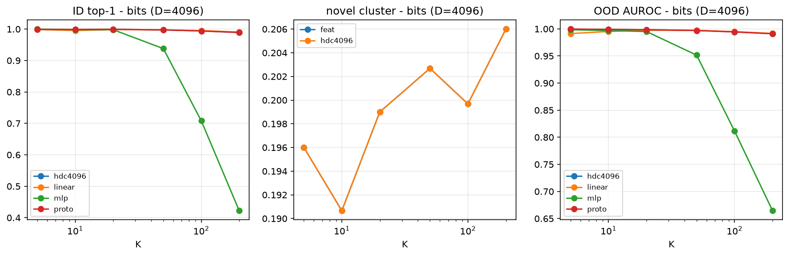

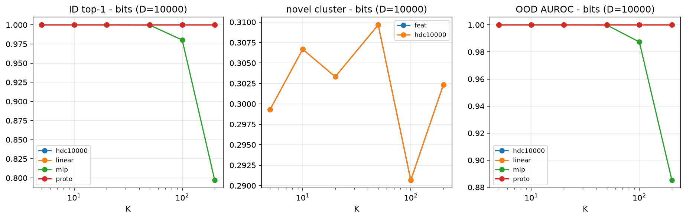

**Takeaways - `bits`.**

* ID accuracy is essentially flat with K for the prototype heads at both dims:
  HDC 4k `0.999 -> 0.989` and HDC 10k `1.000` at every K up to 200.  Random
  hypervectors have enormous prototype capacity at these K/D ratios; the
  prototype head shows **no K-degradation** in the well-separated regime.
* The 2-layer MLP is the casualty: `1.00 -> 0.42` (4k) / `0.80` (10k) as K
  grows.  With 60 samples per class and near-random 4k/10k-dim inputs, the
  network layer underfits/overfits while the closed-form prototype and the
  linear layer stay strong.  This is a genuine "network head on hard codes"
  failure mode, not an HDC win by construction.
* Robustness: at a 46% flip rate the 10k codes hold `0.999 -> 0.994` over
  K = 5..200 while the 4k codes fall `0.977 -> 0.758`; at 48% flips 10k holds
  `0.912 -> 0.498` while 4k falls `0.748 -> 0.175`.  This is the one place
  where **dimension size clearly buys robustness**.
* OOD detection is near perfect for prototypes at every K (`1.000 -> 0.991`);
  the MLP detector collapses with K (`0.81` at K = 100, `0.66` at K = 200).
* 5-shot novel prototypes beat a 5-shot linear layer (`0.57 vs 0.46`) at every
  K - the prototype rule is the data-efficient option when labels are scarce.

### 2.2 `gmm` and `subspace` - projected synthetic features

ID accuracy vs K - gmm

| head | 5 | 10 | 20 | 50 | 100 | 200 |
| :--- | ---: | ---: | ---: | ---: | ---: | ---: |
| hdc4096 | 0.984 ± 0.005 | 0.968 ± 0.003 | 0.935 ± 0.004 | 0.897 ± 0.004 | 0.850 ± 0.005 | 0.796 ± 0.002 |
| hdc10000 | 0.987 ± 0.003 | 0.973 ± 0.006 | 0.946 ± 0.008 | 0.911 ± 0.005 | 0.868 ± 0.001 | 0.821 ± 0.001 |
| linear | 0.886 ± 0.013 | 0.919 ± 0.012 | 0.916 ± 0.006 | 0.901 ± 0.003 | 0.867 ± 0.003 | 0.828 ± 0.002 |
| mlp | 0.986 ± 0.004 | 0.970 ± 0.004 | 0.933 ± 0.007 | 0.857 ± 0.002 | 0.782 ± 0.007 | 0.705 ± 0.003 |
| proto | 0.992 ± 0.003 | 0.977 ± 0.004 | 0.955 ± 0.005 | 0.923 ± 0.004 | 0.884 ± 0.002 | 0.838 ± 0.002 |

ID accuracy by HD dimension - gmm

| K | hdc4096 | hdc10000 | linear | mlp | proto | hdc10k - hdc4k |
| ---: | ---: | ---: | ---: | ---: | ---: | ---: |
| 5 | 0.984 ± 0.005 | 0.987 ± 0.003 | 0.886 ± 0.013 | 0.986 ± 0.004 | 0.992 ± 0.003 | +0.003 |
| 10 | 0.968 ± 0.003 | 0.973 ± 0.006 | 0.919 ± 0.012 | 0.970 ± 0.004 | 0.977 ± 0.004 | +0.005 |
| 20 | 0.935 ± 0.004 | 0.946 ± 0.008 | 0.916 ± 0.006 | 0.933 ± 0.007 | 0.955 ± 0.005 | +0.011 |
| 50 | 0.897 ± 0.004 | 0.911 ± 0.005 | 0.901 ± 0.003 | 0.857 ± 0.002 | 0.923 ± 0.004 | +0.014 |
| 100 | 0.850 ± 0.005 | 0.868 ± 0.001 | 0.867 ± 0.003 | 0.782 ± 0.007 | 0.884 ± 0.002 | +0.018 |
| 200 | 0.796 ± 0.002 | 0.821 ± 0.001 | 0.828 ± 0.002 | 0.705 ± 0.003 | 0.838 ± 0.002 | +0.025 |

Robustness vs K - gmm

| K | variant | hdc4096 | hdc10000 | linear | mlp | proto |
| ---: | :--- | ---: | ---: | ---: | ---: | ---: |
| 5 | noise1.5x | 0.874 ± 0.019 | 0.881 ± 0.013 | 0.717 ± 0.013 | 0.876 ± 0.012 | 0.892 ± 0.012 |
| 5 | noise2.5x | 0.645 ± 0.010 | 0.648 ± 0.020 | 0.495 ± 0.012 | 0.640 ± 0.022 | 0.666 ± 0.012 |
| 10 | noise1.5x | 0.791 ± 0.012 | 0.804 ± 0.011 | 0.700 ± 0.017 | 0.798 ± 0.011 | 0.823 ± 0.009 |
| 10 | noise2.5x | 0.499 ± 0.011 | 0.515 ± 0.012 | 0.432 ± 0.007 | 0.505 ± 0.010 | 0.526 ± 0.018 |
| 20 | noise1.5x | 0.699 ± 0.014 | 0.719 ± 0.011 | 0.669 ± 0.012 | 0.688 ± 0.006 | 0.734 ± 0.011 |
| 20 | noise2.5x | 0.366 ± 0.018 | 0.386 ± 0.015 | 0.348 ± 0.012 | 0.368 ± 0.011 | 0.394 ± 0.014 |
| 50 | noise1.5x | 0.569 ± 0.009 | 0.594 ± 0.007 | 0.577 ± 0.008 | 0.519 ± 0.008 | 0.610 ± 0.008 |
| 50 | noise2.5x | 0.241 ± 0.007 | 0.256 ± 0.008 | 0.247 ± 0.006 | 0.219 ± 0.003 | 0.264 ± 0.007 |
| 100 | noise1.5x | 0.475 ± 0.008 | 0.500 ± 0.005 | 0.498 ± 0.007 | 0.406 ± 0.004 | 0.518 ± 0.005 |
| 100 | noise2.5x | 0.169 ± 0.003 | 0.180 ± 0.005 | 0.180 ± 0.003 | 0.146 ± 0.001 | 0.189 ± 0.005 |
| 200 | noise1.5x | 0.386 ± 0.004 | 0.412 ± 0.004 | 0.419 ± 0.004 | 0.318 ± 0.003 | 0.430 ± 0.004 |
| 200 | noise2.5x | 0.117 ± 0.002 | 0.125 ± 0.002 | 0.128 ± 0.003 | 0.097 ± 0.002 | 0.131 ± 0.003 |

Novel no-label cluster acc vs K - gmm

| metric | 5 | 10 | 20 | 50 | 100 | 200 |
| :--- | ---: | ---: | ---: | ---: | ---: | ---: |
| feat | 0.880 ± 0.056 | 0.833 ± 0.060 | 0.821 ± 0.040 | 0.841 ± 0.023 | 0.814 ± 0.039 | 0.851 ± 0.040 |
| hdc10000 | 0.509 ± 0.122 | 0.434 ± 0.072 | 0.474 ± 0.083 | 0.549 ± 0.068 | 0.426 ± 0.050 | 0.482 ± 0.051 |
| hdc4096 | 0.403 ± 0.048 | 0.353 ± 0.033 | 0.407 ± 0.037 | 0.457 ± 0.132 | 0.392 ± 0.035 | 0.401 ± 0.050 |

5-shot novel acc vs K - gmm

| metric | 5 | 10 | 20 | 50 | 100 | 200 |
| :--- | ---: | ---: | ---: | ---: | ---: | ---: |
| hdc10000 | 0.504 ± 0.021 | 0.508 ± 0.019 | 0.509 ± 0.026 | 0.512 ± 0.020 | 0.511 ± 0.016 | 0.504 ± 0.011 |
| hdc4096 | 0.473 ± 0.031 | 0.479 ± 0.024 | 0.482 ± 0.022 | 0.477 ± 0.022 | 0.483 ± 0.016 | 0.477 ± 0.008 |
| linear | 0.323 ± 0.012 | 0.321 ± 0.017 | 0.316 ± 0.013 | 0.331 ± 0.016 | 0.331 ± 0.009 | 0.316 ± 0.020 |
| proto | 0.522 ± 0.026 | 0.528 ± 0.023 | 0.530 ± 0.022 | 0.530 ± 0.013 | 0.529 ± 0.018 | 0.523 ± 0.011 |

ID accuracy vs K - subspace

| head | 5 | 10 | 20 | 50 | 100 | 200 |
| :--- | ---: | ---: | ---: | ---: | ---: | ---: |
| hdc4096 | 0.987 ± 0.002 | 0.975 ± 0.005 | 0.956 ± 0.004 | 0.920 ± 0.004 | 0.883 ± 0.004 | 0.835 ± 0.003 |
| hdc10000 | 0.990 ± 0.001 | 0.980 ± 0.004 | 0.966 ± 0.003 | 0.934 ± 0.004 | 0.900 ± 0.003 | 0.860 ± 0.003 |
| linear | 0.912 ± 0.019 | 0.941 ± 0.004 | 0.939 ± 0.006 | 0.922 ± 0.006 | 0.898 ± 0.002 | 0.866 ± 0.003 |
| mlp | 0.990 ± 0.003 | 0.975 ± 0.003 | 0.957 ± 0.002 | 0.892 ± 0.005 | 0.822 ± 0.006 | 0.752 ± 0.002 |
| proto | 0.991 ± 0.005 | 0.984 ± 0.005 | 0.970 ± 0.003 | 0.941 ± 0.002 | 0.912 ± 0.002 | 0.875 ± 0.002 |

Novel no-label cluster acc vs K - subspace

| metric | 5 | 10 | 20 | 50 | 100 | 200 |
| :--- | ---: | ---: | ---: | ---: | ---: | ---: |
| feat | 0.879 ± 0.044 | 0.885 ± 0.043 | 0.869 ± 0.006 | 0.890 ± 0.026 | 0.846 ± 0.034 | 0.868 ± 0.029 |
| hdc10000 | 0.581 ± 0.078 | 0.630 ± 0.077 | 0.672 ± 0.043 | 0.714 ± 0.066 | 0.647 ± 0.058 | 0.658 ± 0.063 |
| hdc4096 | 0.557 ± 0.091 | 0.582 ± 0.100 | 0.602 ± 0.048 | 0.620 ± 0.067 | 0.511 ± 0.019 | 0.654 ± 0.106 |

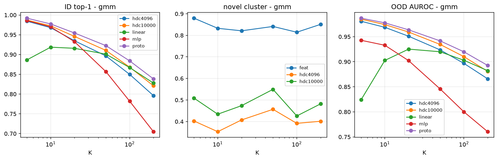

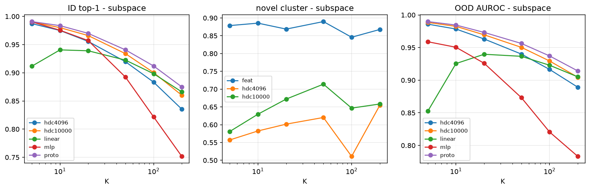

**Takeaways - `gmm` / `subspace`.**

* Both HDC and feature prototypes degrade smoothly with K
  (gmm HDC 4k `0.984 -> 0.796`; subspace `0.987 -> 0.835`), while the linear
  layer is weaker at small K, catches up at K = 50-100, and overtakes at
  K = 200.  The feature prototype (`proto`) is consistently the best
  prototype-based head: the projection+sign step costs ~2-4 points for the
  4k codes and ~1-2 points for the 10k codes at large K.
* HDC 10k > HDC 4k by `+0.013` on average (up to `+0.025` at K = 200), the
  largest dimension effect among all benchmarks: with only 256-d input
  features the random-projection direction has more information to recover.
* Robustness degrades quickly with K for every head (e.g. gmm HDC 4k at
  noise x2.5: `0.65 -> 0.12` from K = 5 to K = 200), roughly in lock-step
  across heads.
* **No-label novel clustering is where HDC is clearly weaker on this data**:
  feature k-means reaches `0.88/0.88` while HDC-code k-means gets `0.40/0.56`
  (gmm/subspace, K = 5, N = 20).  The labelled prototype use of the codes is
  fine, but the sign-code geometry is a poor space for Euclidean k-means.
* 5-shot novel accuracy: the prototype heads beat a 5-shot linear layer by a
  wide margin on gmm (`0.50-0.53` for HDC 10k / feature prototype vs `0.32`
  linear at every K); HDC 10k closes most of the gap to the feature prototype.
  The prototype advantage is largest when labels are few.

### 2.3 Pretraining K with a from-scratch MLP encoder

ID accuracy vs pretraining K (pretrain_mlp)

| head | 5 | 10 | 20 | 50 | 100 |
| :--- | ---: | ---: | ---: | ---: | ---: |
| net | 0.987 ± 0.002 | 0.971 ± 0.002 | 0.939 ± 0.004 | 0.841 ± 0.003 | 0.740 ± 0.007 |
| linear | 0.988 ± 0.003 | 0.972 ± 0.002 | 0.936 ± 0.006 | 0.836 ± 0.004 | 0.745 ± 0.005 |
| mlp | 0.991 ± 0.003 | 0.967 ± 0.002 | 0.917 ± 0.004 | 0.797 ± 0.003 | 0.703 ± 0.006 |
| hdc4096 | 0.991 ± 0.004 | 0.973 ± 0.001 | 0.935 ± 0.007 | 0.825 ± 0.003 | 0.732 ± 0.005 |
| hdc10000 | 0.990 ± 0.004 | 0.971 ± 0.002 | 0.936 ± 0.006 | 0.827 ± 0.005 | 0.741 ± 0.004 |
| proto | 0.991 ± 0.004 | 0.970 ± 0.003 | 0.936 ± 0.007 | 0.833 ± 0.004 | 0.748 ± 0.005 |

Novel metrics vs pretraining K (pretrain_mlp)

| metric | 5 | 10 | 20 | 50 | 100 |
| :--- | ---: | ---: | ---: | ---: | ---: |
| cluster_feat | 0.111 ± 0.003 | 0.116 ± 0.001 | 0.130 ± 0.006 | 0.145 ± 0.008 | 0.152 ± 0.003 |
| cluster_hdc4096 | 0.110 ± 0.004 | 0.117 ± 0.004 | 0.123 ± 0.002 | 0.136 ± 0.005 | 0.141 ± 0.007 |
| cluster_hdc10000 | 0.113 ± 0.001 | 0.121 ± 0.003 | 0.122 ± 0.005 | 0.135 ± 0.001 | 0.161 ± 0.005 |
| auroc_net | 0.926 ± 0.005 | 0.939 ± 0.004 | 0.916 ± 0.002 | 0.865 ± 0.005 | 0.813 ± 0.012 |
| auroc_hdc4096 | 0.901 ± 0.009 | 0.889 ± 0.002 | 0.804 ± 0.007 | 0.654 ± 0.004 | 0.604 ± 0.015 |
| auroc_hdc10000 | 0.903 ± 0.010 | 0.892 ± 0.003 | 0.807 ± 0.008 | 0.661 ± 0.005 | 0.609 ± 0.008 |
| auroc_linear | 0.925 ± 0.009 | 0.940 ± 0.004 | 0.917 ± 0.001 | 0.864 ± 0.003 | 0.817 ± 0.008 |
| auroc_mlp | 0.912 ± 0.008 | 0.910 ± 0.003 | 0.854 ± 0.001 | 0.782 ± 0.001 | 0.739 ± 0.003 |
| auroc_proto | 0.899 ± 0.010 | 0.891 ± 0.003 | 0.807 ± 0.008 | 0.665 ± 0.003 | 0.621 ± 0.008 |
| fewshot5_hdc4096 | 0.079 ± 0.005 | 0.089 ± 0.009 | 0.122 ± 0.004 | 0.161 ± 0.022 | 0.205 ± 0.006 |
| fewshot5_hdc10000 | 0.080 ± 0.004 | 0.088 ± 0.006 | 0.125 ± 0.000 | 0.157 ± 0.019 | 0.214 ± 0.004 |
| fewshot5_proto | 0.079 ± 0.006 | 0.089 ± 0.009 | 0.124 ± 0.003 | 0.162 ± 0.019 | 0.215 ± 0.006 |
| fewshot5_linear | 0.070 ± 0.008 | 0.086 ± 0.010 | 0.123 ± 0.006 | 0.145 ± 0.014 | 0.177 ± 0.006 |

Robustness vs pretraining K (pretrain_mlp)

| K | variant | net | linear | mlp | hdc4096 | hdc10000 | proto |
| ---: | :--- | ---: | ---: | ---: | ---: | ---: | ---: |
| 5 | noise1.5x | 0.883 ± 0.014 | 0.887 ± 0.022 | 0.887 ± 0.021 | 0.887 ± 0.017 | 0.885 ± 0.019 | 0.885 ± 0.018 |
| 5 | noise2.5x | 0.687 ± 0.018 | 0.687 ± 0.020 | 0.687 ± 0.010 | 0.691 ± 0.018 | 0.685 ± 0.015 | 0.693 ± 0.015 |
| 10 | noise1.5x | 0.821 ± 0.015 | 0.820 ± 0.012 | 0.822 ± 0.014 | 0.818 ± 0.014 | 0.820 ± 0.011 | 0.820 ± 0.013 |
| 10 | noise2.5x | 0.542 ± 0.019 | 0.544 ± 0.016 | 0.541 ± 0.015 | 0.546 ± 0.018 | 0.551 ± 0.018 | 0.552 ± 0.016 |
| 20 | noise1.5x | 0.713 ± 0.008 | 0.709 ± 0.011 | 0.673 ± 0.014 | 0.704 ± 0.006 | 0.706 ± 0.010 | 0.707 ± 0.009 |
| 20 | noise2.5x | 0.389 ± 0.015 | 0.385 ± 0.009 | 0.360 ± 0.007 | 0.382 ± 0.005 | 0.384 ± 0.008 | 0.387 ± 0.009 |
| 50 | noise1.5x | 0.515 ± 0.008 | 0.512 ± 0.008 | 0.468 ± 0.007 | 0.499 ± 0.006 | 0.505 ± 0.008 | 0.510 ± 0.005 |
| 50 | noise2.5x | 0.222 ± 0.006 | 0.218 ± 0.008 | 0.198 ± 0.006 | 0.212 ± 0.007 | 0.214 ± 0.008 | 0.216 ± 0.005 |
| 100 | noise1.5x | 0.386 ± 0.001 | 0.394 ± 0.001 | 0.357 ± 0.002 | 0.383 ± 0.001 | 0.391 ± 0.001 | 0.398 ± 0.002 |
| 100 | noise2.5x | 0.139 ± 0.001 | 0.140 ± 0.001 | 0.126 ± 0.001 | 0.137 ± 0.001 | 0.139 ± 0.002 | 0.142 ± 0.002 |

**Takeaways - synthetic pretraining.**

* The network's own ID accuracy falls `0.987 -> 0.740` over K = 5..100.  HDC
  4k on the same frozen penultimate features falls `0.991 -> 0.732` and the
  linear probe `0.988 -> 0.745`: **HDC adds no degradation of its own**; the
  entire loss is the representation shrinking as K grows.
* HDC 10k recovers `+0.002..+0.010` over 4k in ID, again small.
* OOD AUROC separates the heads: the jointly-trained network softmax and the
  linear probe stay at `0.81-0.94` across K, while the prototype-distance
  scores fall from `0.90` at K = 5 to `0.60-0.67` at K = 50.  Prototype
  distance is a good novelty score in low-K / clean-geometry settings but
  loses calibration as K grows.
* Novel no-label clustering is low for every representation in this setup
  (`0.11-0.15`); the MLP encoder is trained for classification, and its
  penultimate space is not clustered by class.

---

## 3. CIFAR-100

### 3.1 ID accuracy and robustness vs K (frozen DINOv2 ViT-B/14-reg)

cifar100 / dinov2_vitb14_reg: ID accuracy vs K

| head | 5 | 10 | 20 | 50 | 100 |
| :--- | ---: | ---: | ---: | ---: | ---: |
| hdc4096 | 0.957 ± 0.013 | 0.906 ± 0.023 | 0.867 ± 0.022 | 0.788 ± 0.007 | 0.724 ± 0.000 |
| hdc10000 | 0.956 ± 0.016 | 0.909 ± 0.021 | 0.868 ± 0.020 | 0.792 ± 0.007 | 0.726 ± 0.000 |
| linear | 0.962 ± 0.015 | 0.922 ± 0.022 | 0.893 ± 0.020 | 0.828 ± 0.004 | 0.777 ± 0.000 |
| mlp | 0.976 ± 0.010 | 0.945 ± 0.021 | 0.911 ± 0.020 | 0.844 ± 0.008 | 0.778 ± 0.002 |
| proto | 0.959 ± 0.013 | 0.909 ± 0.020 | 0.870 ± 0.020 | 0.793 ± 0.006 | 0.726 ± 0.000 |

cifar100 / dinov2_vitb14_reg: ID accuracy by HD dimension

| K | hdc4096 | hdc10000 | linear | mlp | proto | hdc10k - hdc4k |
| ---: | ---: | ---: | ---: | ---: | ---: | ---: |
| 5 | 0.957 ± 0.013 | 0.956 ± 0.016 | 0.962 ± 0.015 | 0.976 ± 0.010 | 0.959 ± 0.013 | -0.001 |
| 10 | 0.906 ± 0.023 | 0.909 ± 0.021 | 0.922 ± 0.022 | 0.945 ± 0.021 | 0.909 ± 0.020 | +0.003 |
| 20 | 0.867 ± 0.022 | 0.868 ± 0.020 | 0.893 ± 0.020 | 0.911 ± 0.020 | 0.870 ± 0.020 | +0.001 |
| 50 | 0.788 ± 0.007 | 0.792 ± 0.007 | 0.828 ± 0.004 | 0.844 ± 0.008 | 0.793 ± 0.006 | +0.004 |
| 100 | 0.724 ± 0.000 | 0.726 ± 0.000 | 0.777 ± 0.000 | 0.778 ± 0.002 | 0.726 ± 0.000 | +0.002 |

cifar100 / dinov2_vitb14_reg: robustness vs K

| K | variant | hdc4096 | hdc10000 | linear | mlp | proto |
| ---: | :--- | ---: | ---: | ---: | ---: | ---: |
| 5 | noise0.05 | 0.820 ± 0.020 | 0.835 ± 0.005 | 0.865 ± 0.008 | 0.886 ± 0.023 | 0.835 ± 0.012 |
| 5 | noise0.10 | 0.767 ± 0.011 | 0.779 ± 0.013 | 0.822 ± 0.013 | 0.854 ± 0.019 | 0.779 ± 0.016 |
| 10 | noise0.05 | 0.724 ± 0.044 | 0.732 ± 0.051 | 0.785 ± 0.047 | 0.798 ± 0.043 | 0.735 ± 0.051 |
| 10 | noise0.10 | 0.683 ± 0.048 | 0.689 ± 0.049 | 0.744 ± 0.047 | 0.770 ± 0.039 | 0.694 ± 0.050 |
| 20 | noise0.05 | 0.628 ± 0.033 | 0.637 ± 0.033 | 0.702 ± 0.028 | 0.716 ± 0.032 | 0.643 ± 0.026 |
| 20 | noise0.10 | 0.601 ± 0.037 | 0.610 ± 0.036 | 0.678 ± 0.030 | 0.716 ± 0.037 | 0.614 ± 0.034 |
| 50 | noise0.05 | 0.529 ± 0.011 | 0.534 ± 0.010 | 0.596 ± 0.007 | 0.587 ± 0.006 | 0.539 ± 0.006 |
| 50 | noise0.10 | 0.515 ± 0.013 | 0.522 ± 0.010 | 0.590 ± 0.010 | 0.589 ± 0.007 | 0.527 ± 0.010 |
| 100 | noise0.05 | 0.459 ± 0.002 | 0.460 ± 0.001 | 0.527 ± 0.000 | 0.478 ± 0.003 | 0.464 ± 0.000 |
| 100 | noise0.10 | 0.452 ± 0.001 | 0.454 ± 0.000 | 0.525 ± 0.000 | 0.480 ± 0.004 | 0.458 ± 0.000 |

### 3.2 Novel classes without labels and OOD detection

cifar100 / dinov2_vitb14_reg: novel no-label k-means accuracy vs K (N=20)

| space | 5 | 10 | 20 | 50 | 100 |
| :--- | ---: | ---: | ---: | ---: | ---: |
| cluster_feat | 0.691 ± 0.014 | 0.704 ± 0.039 | 0.702 ± 0.030 | 0.703 ± 0.052 | - |
| cluster_hdc4096 | 0.679 ± 0.018 | 0.704 ± 0.030 | 0.683 ± 0.040 | 0.702 ± 0.053 | - |
| cluster_hdc10000 | 0.672 ± 0.025 | 0.731 ± 0.026 | 0.678 ± 0.017 | 0.698 ± 0.048 | - |

cifar100 / dinov2_vitb14_reg: OOD AUROC (known vs novel) vs K (N=20)

| score | 5 | 10 | 20 | 50 | 100 |
| :--- | ---: | ---: | ---: | ---: | ---: |
| auroc_hdc4096 | 0.950 ± 0.035 | 0.916 ± 0.019 | 0.901 ± 0.014 | 0.827 ± 0.012 | - |
| auroc_hdc10000 | 0.952 ± 0.033 | 0.917 ± 0.017 | 0.905 ± 0.012 | 0.829 ± 0.010 | - |
| auroc_linear | 0.953 ± 0.030 | 0.923 ± 0.024 | 0.908 ± 0.008 | 0.830 ± 0.029 | - |
| auroc_mlp | 0.947 ± 0.023 | 0.891 ± 0.045 | 0.865 ± 0.028 | 0.796 ± 0.016 | - |
| auroc_proto | 0.952 ± 0.033 | 0.917 ± 0.016 | 0.905 ± 0.012 | 0.828 ± 0.011 | - |

cifar100 / dinov2_vitb14_reg: novel metrics vs N (K=50)

| metric | 5 | 10 | 20 | 40 |
| :--- | ---: | ---: | ---: | ---: |
| cluster_feat | 0.860 ± 0.066 | 0.800 ± 0.060 | 0.703 ± 0.052 | 0.612 ± 0.016 |
| cluster_hdc4096 | 0.858 ± 0.069 | 0.762 ± 0.051 | 0.702 ± 0.053 | 0.603 ± 0.018 |
| cluster_hdc10000 | 0.867 ± 0.067 | 0.760 ± 0.049 | 0.698 ± 0.048 | 0.630 ± 0.020 |
| auroc_hdc4096 | 0.820 ± 0.021 | 0.799 ± 0.022 | 0.827 ± 0.012 | 0.830 ± 0.010 |
| auroc_hdc10000 | 0.827 ± 0.016 | 0.800 ± 0.020 | 0.829 ± 0.010 | 0.832 ± 0.010 |
| auroc_linear | 0.838 ± 0.025 | 0.801 ± 0.041 | 0.830 ± 0.029 | 0.833 ± 0.017 |
| auroc_mlp | 0.803 ± 0.019 | 0.781 ± 0.012 | 0.796 ± 0.016 | 0.795 ± 0.009 |
| auroc_proto | 0.824 ± 0.018 | 0.799 ± 0.020 | 0.828 ± 0.011 | 0.831 ± 0.011 |
| fewshot5_hdc4096 | 0.873 ± 0.061 | 0.860 ± 0.024 | 0.802 ± 0.032 | 0.716 ± 0.006 |
| fewshot5_hdc10000 | 0.878 ± 0.057 | 0.861 ± 0.028 | 0.802 ± 0.032 | 0.718 ± 0.005 |
| fewshot5_proto | 0.880 ± 0.059 | 0.862 ± 0.029 | 0.804 ± 0.032 | 0.720 ± 0.005 |
| fewshot5_linear | 0.883 ± 0.058 | 0.871 ± 0.029 | 0.808 ± 0.033 | 0.716 ± 0.003 |

### 3.3 ResNet-18 features (weaker/supervised backbone control)

cifar100 / resnet18: ID accuracy vs K

| head | 5 | 10 | 20 | 50 | 100 |
| :--- | ---: | ---: | ---: | ---: | ---: |
| hdc4096 | 0.837 ± 0.040 | 0.743 ± 0.049 | 0.655 ± 0.023 | 0.504 ± 0.007 | 0.398 ± 0.002 |
| hdc10000 | 0.841 ± 0.035 | 0.752 ± 0.045 | 0.663 ± 0.021 | 0.507 ± 0.009 | 0.399 ± 0.001 |
| linear | 0.848 ± 0.034 | 0.766 ± 0.039 | 0.682 ± 0.019 | 0.534 ± 0.008 | 0.453 ± 0.000 |
| mlp | 0.911 ± 0.018 | 0.840 ± 0.036 | 0.763 ± 0.019 | 0.623 ± 0.008 | 0.537 ± 0.001 |
| proto | 0.838 ± 0.036 | 0.749 ± 0.047 | 0.662 ± 0.020 | 0.505 ± 0.007 | 0.396 ± 0.000 |

cifar100 / resnet18: ID accuracy by HD dimension

| K | hdc4096 | hdc10000 | linear | mlp | proto | hdc10k - hdc4k |
| ---: | ---: | ---: | ---: | ---: | ---: | ---: |
| 5 | 0.837 ± 0.040 | 0.841 ± 0.035 | 0.848 ± 0.034 | 0.911 ± 0.018 | 0.838 ± 0.036 | +0.004 |
| 10 | 0.743 ± 0.049 | 0.752 ± 0.045 | 0.766 ± 0.039 | 0.840 ± 0.036 | 0.749 ± 0.047 | +0.009 |
| 20 | 0.655 ± 0.023 | 0.663 ± 0.021 | 0.682 ± 0.019 | 0.763 ± 0.019 | 0.662 ± 0.020 | +0.009 |
| 50 | 0.504 ± 0.007 | 0.507 ± 0.009 | 0.534 ± 0.008 | 0.623 ± 0.008 | 0.505 ± 0.007 | +0.003 |
| 100 | 0.398 ± 0.002 | 0.399 ± 0.001 | 0.453 ± 0.000 | 0.537 ± 0.001 | 0.396 ± 0.000 | +0.001 |

cifar100 / resnet18: novel no-label k-means accuracy vs K (N=20)

| space | 5 | 10 | 20 | 50 | 100 |
| :--- | ---: | ---: | ---: | ---: | ---: |
| cluster_feat | 0.459 ± 0.012 | 0.453 ± 0.049 | 0.431 ± 0.041 | 0.440 ± 0.042 | - |
| cluster_hdc4096 | 0.448 ± 0.017 | 0.438 ± 0.046 | 0.429 ± 0.032 | 0.429 ± 0.046 | - |
| cluster_hdc10000 | 0.433 ± 0.014 | 0.435 ± 0.049 | 0.417 ± 0.020 | 0.432 ± 0.042 | - |

cifar100 / resnet18: OOD AUROC (known vs novel) vs K (N=20)

| score | 5 | 10 | 20 | 50 | 100 |
| :--- | ---: | ---: | ---: | ---: | ---: |
| auroc_hdc4096 | 0.749 ± 0.030 | 0.687 ± 0.016 | 0.689 ± 0.020 | 0.601 ± 0.013 | - |
| auroc_hdc10000 | 0.765 ± 0.030 | 0.698 ± 0.020 | 0.696 ± 0.016 | 0.600 ± 0.015 | - |
| auroc_linear | 0.712 ± 0.061 | 0.681 ± 0.061 | 0.660 ± 0.027 | 0.583 ± 0.015 | - |
| auroc_mlp | 0.760 ± 0.039 | 0.719 ± 0.047 | 0.700 ± 0.026 | 0.637 ± 0.020 | - |
| auroc_proto | 0.762 ± 0.030 | 0.697 ± 0.019 | 0.696 ± 0.016 | 0.600 ± 0.014 | - |

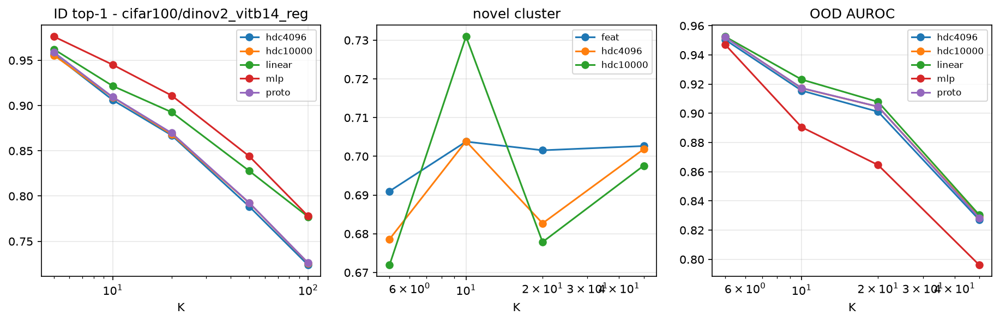

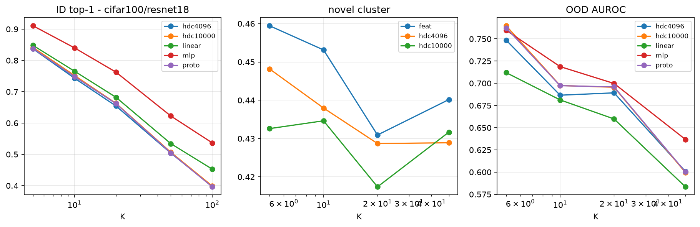

**Takeaways - CIFAR-100.**

* With DINOv2 features, HDC ID accuracy degrades `0.957 -> 0.724` from K = 5
  to 100; the linear head goes `0.962 -> 0.777` and the MLP `0.976 -> 0.778`.
  HDC degrades at the same rate as the network layer (the gap stays ~2-5
  points) - more classes make the frozen feature geometry harder, and all
  heads pay.
* HDC 10k - HDC 4k is `+0.001..+0.004` at every K; doubling the HD dimension
  does not recover the gap to the linear layer at large K.
* Noise robustness degrades with K for all heads, HDC by about the same
  absolute margin as the trained layers (K = 50, noise 0.10: HDC 4k `0.515` vs
  linear `0.590`).
* Novel no-label clustering is flat in K (`0.68-0.70` for HDC, `0.69-0.70`
  for features) but falls with N (`0.86 -> 0.61` features, `0.86 -> 0.60` HDC
  from N = 5 to 40).  HDC and raw features are tied within noise.
* OOD AUROC falls with K (`0.95 -> 0.83` for both HDC and linear): the more
  base classes there are, the more likely a novel sample is close to some base
  prototype.  It is flat in N (`~0.83`), so it is the *known* class count that
  governs novelty detection.
* 5-shot novel accuracy is `0.80-0.88` for HDC, proto and linear - the stronger
  the features, the less the head matters.
* On ResNet-18 features the ranking is the same but the absolute level is much
  lower (K = 100: HDC `0.398`, linear `0.453`, MLP `0.537`).  The MLP head's
  advantage grows on weaker features, and HDC 10k helps slightly more
  (`+0.004` mean).

---

## 4. TinyImageNet

### 4.1 ID accuracy and robustness vs K (frozen DINOv2 ViT-B/14-reg)

tinyimagenet / dinov2_vitb14_reg: ID accuracy vs K

| head | 10 | 20 | 50 | 100 | 200 |
| :--- | ---: | ---: | ---: | ---: | ---: |
| hdc4096 | 0.960 ± 0.001 | 0.943 ± 0.010 | 0.904 ± 0.007 | 0.872 ± 0.008 | 0.834 ± 0.000 |
| hdc10000 | 0.960 ± 0.001 | 0.943 ± 0.012 | 0.906 ± 0.007 | 0.873 ± 0.008 | 0.835 ± 0.000 |
| linear | 0.964 ± 0.001 | 0.946 ± 0.013 | 0.916 ± 0.006 | 0.892 ± 0.005 | 0.864 ± 0.000 |
| mlp | 0.971 ± 0.004 | 0.956 ± 0.010 | 0.921 ± 0.005 | 0.888 ± 0.005 | 0.850 ± 0.000 |
| proto | 0.960 ± 0.001 | 0.944 ± 0.011 | 0.907 ± 0.007 | 0.874 ± 0.008 | 0.836 ± 0.000 |

tinyimagenet / dinov2_vitb14_reg: ID accuracy by HD dimension

| K | hdc4096 | hdc10000 | linear | mlp | proto | hdc10k - hdc4k |
| ---: | ---: | ---: | ---: | ---: | ---: | ---: |
| 10 | 0.960 ± 0.001 | 0.960 ± 0.001 | 0.964 ± 0.001 | 0.971 ± 0.004 | 0.960 ± 0.001 | +0.000 |
| 20 | 0.943 ± 0.010 | 0.943 ± 0.012 | 0.946 ± 0.013 | 0.956 ± 0.010 | 0.944 ± 0.011 | +0.001 |
| 50 | 0.904 ± 0.007 | 0.906 ± 0.007 | 0.916 ± 0.006 | 0.921 ± 0.005 | 0.907 ± 0.007 | +0.002 |
| 100 | 0.872 ± 0.008 | 0.873 ± 0.008 | 0.892 ± 0.005 | 0.888 ± 0.005 | 0.874 ± 0.008 | +0.001 |
| 200 | 0.834 ± 0.000 | 0.835 ± 0.000 | 0.864 ± 0.000 | 0.850 ± 0.000 | 0.836 ± 0.000 | +0.001 |

tinyimagenet / dinov2_vitb14_reg: robustness vs K

| K | variant | hdc4096 | hdc10000 | linear | mlp | proto |
| ---: | :--- | ---: | ---: | ---: | ---: | ---: |
| 10 | noise0.05 | 0.936 ± 0.003 | 0.939 ± 0.003 | 0.944 ± 0.003 | 0.958 ± 0.006 | 0.939 ± 0.005 |
| 10 | noise0.10 | 0.911 ± 0.005 | 0.914 ± 0.004 | 0.919 ± 0.003 | 0.937 ± 0.008 | 0.916 ± 0.002 |
| 20 | noise0.05 | 0.910 ± 0.012 | 0.911 ± 0.010 | 0.922 ± 0.011 | 0.933 ± 0.010 | 0.914 ± 0.009 |
| 20 | noise0.10 | 0.873 ± 0.017 | 0.874 ± 0.015 | 0.890 ± 0.011 | 0.904 ± 0.011 | 0.878 ± 0.016 |
| 50 | noise0.05 | 0.863 ± 0.012 | 0.864 ± 0.011 | 0.881 ± 0.008 | 0.887 ± 0.006 | 0.866 ± 0.009 |
| 50 | noise0.10 | 0.820 ± 0.017 | 0.824 ± 0.015 | 0.845 ± 0.013 | 0.847 ± 0.014 | 0.826 ± 0.015 |
| 100 | noise0.05 | 0.823 ± 0.011 | 0.825 ± 0.011 | 0.851 ± 0.009 | 0.841 ± 0.008 | 0.827 ± 0.011 |
| 100 | noise0.10 | 0.778 ± 0.016 | 0.780 ± 0.017 | 0.810 ± 0.014 | 0.793 ± 0.009 | 0.782 ± 0.016 |
| 200 | noise0.05 | 0.779 ± 0.000 | 0.781 ± 0.001 | 0.816 ± 0.000 | 0.791 ± 0.001 | 0.783 ± 0.000 |
| 200 | noise0.10 | 0.727 ± 0.001 | 0.729 ± 0.000 | 0.768 ± 0.000 | 0.736 ± 0.000 | 0.732 ± 0.000 |

### 4.2 Novel classes without labels and OOD detection

tinyimagenet / dinov2_vitb14_reg: novel no-label k-means accuracy vs K (N=20)

| space | 10 | 20 | 50 | 100 | 200 |
| :--- | ---: | ---: | ---: | ---: | ---: |
| cluster_feat | 0.833 ± 0.012 | 0.857 ± 0.044 | 0.832 ± 0.030 | 0.852 ± 0.019 | - |
| cluster_hdc4096 | 0.852 ± 0.021 | 0.858 ± 0.024 | 0.870 ± 0.048 | 0.860 ± 0.017 | - |
| cluster_hdc10000 | 0.877 ± 0.035 | 0.812 ± 0.025 | 0.853 ± 0.039 | 0.865 ± 0.020 | - |

tinyimagenet / dinov2_vitb14_reg: OOD AUROC (known vs novel) vs K (N=20)

| score | 10 | 20 | 50 | 100 | 200 |
| :--- | ---: | ---: | ---: | ---: | ---: |
| auroc_hdc4096 | 0.983 ± 0.003 | 0.963 ± 0.009 | 0.954 ± 0.013 | 0.919 ± 0.018 | - |
| auroc_hdc10000 | 0.983 ± 0.004 | 0.964 ± 0.007 | 0.955 ± 0.012 | 0.919 ± 0.018 | - |
| auroc_linear | 0.979 ± 0.004 | 0.961 ± 0.007 | 0.949 ± 0.013 | 0.915 ± 0.015 | - |
| auroc_mlp | 0.975 ± 0.005 | 0.951 ± 0.009 | 0.919 ± 0.018 | 0.878 ± 0.010 | - |
| auroc_proto | 0.984 ± 0.004 | 0.965 ± 0.007 | 0.956 ± 0.012 | 0.919 ± 0.018 | - |

tinyimagenet / dinov2_vitb14_reg: novel metrics vs N (K=100)

| metric | 5 | 10 | 20 | 25 | 50 | 100 |
| :--- | ---: | ---: | ---: | ---: | ---: | ---: |
| cluster_feat | 0.976 ± 0.017 | 0.926 ± 0.054 | 0.852 ± 0.019 | 0.833 ± 0.013 | 0.764 ± 0.016 | 0.740 ± 0.030 |
| cluster_hdc4096 | 0.975 ± 0.016 | 0.875 ± 0.051 | 0.860 ± 0.017 | 0.817 ± 0.009 | 0.768 ± 0.018 | 0.729 ± 0.021 |
| cluster_hdc10000 | 0.976 ± 0.018 | 0.924 ± 0.054 | 0.865 ± 0.020 | 0.811 ± 0.014 | 0.765 ± 0.011 | 0.732 ± 0.027 |
| auroc_hdc4096 | 0.932 ± 0.025 | 0.932 ± 0.013 | 0.919 ± 0.018 | 0.918 ± 0.013 | 0.921 ± 0.009 | 0.925 ± 0.008 |
| auroc_hdc10000 | 0.932 ± 0.025 | 0.932 ± 0.013 | 0.919 ± 0.018 | 0.918 ± 0.013 | 0.922 ± 0.009 | 0.925 ± 0.007 |
| auroc_linear | 0.920 ± 0.028 | 0.923 ± 0.013 | 0.915 ± 0.015 | 0.916 ± 0.011 | 0.920 ± 0.007 | 0.922 ± 0.006 |
| auroc_mlp | 0.870 ± 0.035 | 0.880 ± 0.014 | 0.878 ± 0.010 | 0.878 ± 0.008 | 0.876 ± 0.003 | 0.878 ± 0.005 |
| auroc_proto | 0.932 ± 0.025 | 0.931 ± 0.012 | 0.919 ± 0.018 | 0.918 ± 0.013 | 0.922 ± 0.009 | 0.925 ± 0.007 |
| fewshot5_hdc4096 | 0.971 ± 0.014 | 0.944 ± 0.015 | 0.910 ± 0.005 | 0.909 ± 0.005 | 0.872 ± 0.011 | 0.836 ± 0.010 |
| fewshot5_hdc10000 | 0.971 ± 0.015 | 0.949 ± 0.014 | 0.914 ± 0.007 | 0.914 ± 0.005 | 0.875 ± 0.011 | 0.839 ± 0.009 |
| fewshot5_proto | 0.972 ± 0.015 | 0.950 ± 0.015 | 0.915 ± 0.007 | 0.916 ± 0.006 | 0.877 ± 0.011 | 0.841 ± 0.008 |
| fewshot5_linear | 0.967 ± 0.019 | 0.943 ± 0.008 | 0.904 ± 0.002 | 0.903 ± 0.006 | 0.869 ± 0.009 | 0.837 ± 0.008 |

### 4.3 ResNet-18 features

tinyimagenet / resnet18: ID accuracy vs K

| head | 10 | 20 | 50 | 100 | 200 |
| :--- | ---: | ---: | ---: | ---: | ---: |
| hdc4096 | 0.847 ± 0.020 | 0.787 ± 0.019 | 0.690 ± 0.023 | 0.617 ± 0.015 | 0.536 ± 0.000 |
| hdc10000 | 0.851 ± 0.019 | 0.791 ± 0.020 | 0.693 ± 0.024 | 0.622 ± 0.016 | 0.541 ± 0.001 |
| linear | 0.845 ± 0.018 | 0.788 ± 0.018 | 0.706 ± 0.023 | 0.650 ± 0.016 | 0.588 ± 0.000 |
| mlp | 0.888 ± 0.016 | 0.837 ± 0.010 | 0.758 ± 0.017 | 0.696 ± 0.014 | 0.623 ± 0.001 |
| proto | 0.852 ± 0.022 | 0.790 ± 0.021 | 0.694 ± 0.024 | 0.621 ± 0.015 | 0.541 ± 0.000 |

tinyimagenet / resnet18: ID accuracy by HD dimension

| K | hdc4096 | hdc10000 | linear | mlp | proto | hdc10k - hdc4k |
| ---: | ---: | ---: | ---: | ---: | ---: | ---: |
| 10 | 0.847 ± 0.020 | 0.851 ± 0.019 | 0.845 ± 0.018 | 0.888 ± 0.016 | 0.852 ± 0.022 | +0.005 |
| 20 | 0.787 ± 0.019 | 0.791 ± 0.020 | 0.788 ± 0.018 | 0.837 ± 0.010 | 0.790 ± 0.021 | +0.004 |
| 50 | 0.690 ± 0.023 | 0.693 ± 0.024 | 0.706 ± 0.023 | 0.758 ± 0.017 | 0.694 ± 0.024 | +0.003 |
| 100 | 0.617 ± 0.015 | 0.622 ± 0.016 | 0.650 ± 0.016 | 0.696 ± 0.014 | 0.621 ± 0.015 | +0.005 |
| 200 | 0.536 ± 0.000 | 0.541 ± 0.001 | 0.588 ± 0.000 | 0.623 ± 0.001 | 0.541 ± 0.000 | +0.005 |

tinyimagenet / resnet18: novel no-label k-means accuracy vs K (N=20)

| space | 10 | 20 | 50 | 100 | 200 |
| :--- | ---: | ---: | ---: | ---: | ---: |
| cluster_feat | 0.644 ± 0.023 | 0.627 ± 0.052 | 0.649 ± 0.027 | 0.633 ± 0.012 | - |
| cluster_hdc4096 | 0.629 ± 0.030 | 0.621 ± 0.037 | 0.651 ± 0.016 | 0.660 ± 0.028 | - |
| cluster_hdc10000 | 0.648 ± 0.023 | 0.608 ± 0.030 | 0.646 ± 0.035 | 0.650 ± 0.024 | - |

tinyimagenet / resnet18: OOD AUROC (known vs novel) vs K (N=20)

| score | 10 | 20 | 50 | 100 | 200 |
| :--- | ---: | ---: | ---: | ---: | ---: |
| auroc_hdc4096 | 0.817 ± 0.033 | 0.730 ± 0.040 | 0.722 ± 0.031 | 0.660 ± 0.027 | - |
| auroc_hdc10000 | 0.821 ± 0.032 | 0.740 ± 0.037 | 0.726 ± 0.032 | 0.664 ± 0.023 | - |
| auroc_linear | 0.817 ± 0.013 | 0.759 ± 0.003 | 0.708 ± 0.057 | 0.680 ± 0.015 | - |
| auroc_mlp | 0.842 ± 0.016 | 0.808 ± 0.007 | 0.741 ± 0.029 | 0.720 ± 0.017 | - |
| auroc_proto | 0.822 ± 0.032 | 0.739 ± 0.039 | 0.727 ± 0.031 | 0.665 ± 0.025 | - |

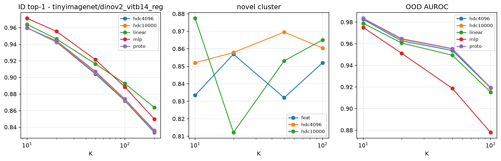

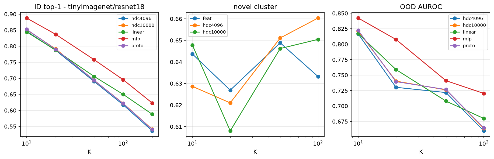

**Takeaways - TinyImageNet.**

* The same pattern at 200 classes: DINOv2 HDC `0.960 -> 0.834` from K = 10 to
  200, linear `0.964 -> 0.864`, MLP `0.971 -> 0.850`.  The HDC-vs-linear gap
  grows from `-0.004` at K = 10 to `-0.030` at K = 200.
* HDC 10k - 4k is `+0.001..+0.005`, again negligible; ResNet-18 shows the same
  `+0.003..+0.005` dimension range.
* Novel no-label clustering with HDC tracks feature k-means closely and falls
  from `0.98` (N = 5) to `0.73` (N = 100).  OOD AUROC is stable in N
  (`0.92-0.93`) and falls modestly with K (`0.983` at K = 10 to `0.919` at
  K = 100; K = 200 has no novel classes).
* 5-shot novel accuracy is `0.84-0.97` for all heads; with 5 examples per
  class on 200 classes, HDC still matches the trained linear layer.
* On ResNet-18 features HDC `0.847 -> 0.536` vs linear `0.845 -> 0.588` and MLP
  `0.888 -> 0.623`.

---

## 5. Pretraining-class scaling on real images (from-scratch networks)

Each network is trained from scratch on K classes; all heads then use its
frozen penultimate features.  `net` is the network's own classifier, i.e. the
upper reference for "what the network learned".

### 5.1 CIFAR-100 small ResNet

ID accuracy vs pretraining K (pretrain_cifar)

| head | 5 | 10 | 20 | 50 | 100 |
| :--- | ---: | ---: | ---: | ---: | ---: |
| net | 0.923 ± 0.016 | 0.882 ± 0.009 | 0.847 ± 0.004 | 0.789 ± 0.018 | 0.714 ± 0.004 |
| linear | 0.921 ± 0.019 | 0.880 ± 0.004 | 0.846 ± 0.002 | 0.789 ± 0.019 | 0.717 ± 0.001 |
| mlp | 0.925 ± 0.016 | 0.886 ± 0.005 | 0.846 ± 0.004 | 0.776 ± 0.017 | 0.700 ± 0.001 |
| hdc4096 | 0.922 ± 0.016 | 0.882 ± 0.004 | 0.845 ± 0.003 | 0.782 ± 0.015 | 0.698 ± 0.002 |
| hdc10000 | 0.923 ± 0.016 | 0.880 ± 0.004 | 0.844 ± 0.005 | 0.783 ± 0.014 | 0.702 ± 0.002 |
| proto | 0.923 ± 0.016 | 0.880 ± 0.004 | 0.845 ± 0.004 | 0.785 ± 0.015 | 0.703 ± 0.002 |

Robustness vs pretraining K (pretrain_cifar)

| K | variant | net | linear | mlp | hdc4096 | hdc10000 | proto |
| ---: | :--- | ---: | ---: | ---: | ---: | ---: | ---: |
| 5 | noise0.05 | 0.865 ± 0.030 | 0.861 ± 0.039 | 0.868 ± 0.033 | 0.866 ± 0.041 | 0.862 ± 0.041 | 0.862 ± 0.038 |
| 5 | noise0.10 | 0.666 ± 0.051 | 0.679 ± 0.072 | 0.683 ± 0.064 | 0.681 ± 0.074 | 0.673 ± 0.074 | 0.681 ± 0.073 |
| 10 | noise0.05 | 0.753 ± 0.008 | 0.761 ± 0.004 | 0.755 ± 0.008 | 0.765 ± 0.005 | 0.759 ± 0.007 | 0.763 ± 0.006 |
| 10 | noise0.10 | 0.408 ± 0.050 | 0.417 ± 0.041 | 0.415 ± 0.050 | 0.421 ± 0.050 | 0.418 ± 0.047 | 0.420 ± 0.045 |
| 20 | noise0.05 | 0.670 ± 0.007 | 0.677 ± 0.008 | 0.668 ± 0.009 | 0.669 ± 0.009 | 0.669 ± 0.011 | 0.669 ± 0.010 |
| 20 | noise0.10 | 0.290 ± 0.020 | 0.298 ± 0.032 | 0.279 ± 0.028 | 0.298 ± 0.035 | 0.296 ± 0.037 | 0.300 ± 0.034 |
| 50 | noise0.05 | 0.431 ± 0.003 | 0.436 ± 0.007 | 0.420 ± 0.005 | 0.428 ± 0.006 | 0.428 ± 0.009 | 0.432 ± 0.008 |
| 50 | noise0.10 | 0.157 ± 0.009 | 0.163 ± 0.013 | 0.145 ± 0.011 | 0.164 ± 0.012 | 0.163 ± 0.013 | 0.166 ± 0.013 |
| 100 | noise0.05 | 0.283 ± 0.007 | 0.296 ± 0.006 | 0.279 ± 0.005 | 0.289 ± 0.009 | 0.291 ± 0.008 | 0.293 ± 0.009 |
| 100 | noise0.10 | 0.074 ± 0.002 | 0.079 ± 0.001 | 0.077 ± 0.005 | 0.081 ± 0.004 | 0.083 ± 0.003 | 0.083 ± 0.003 |

Novel metrics vs pretraining K (pretrain_cifar)

| metric | 5 | 10 | 20 | 50 | 100 |
| :--- | ---: | ---: | ---: | ---: | ---: |
| cluster_feat | 0.225 ± 0.015 | 0.274 ± 0.037 | 0.337 ± 0.011 | 0.494 ± 0.053 | - |
| cluster_hdc4096 | 0.220 ± 0.018 | 0.287 ± 0.034 | 0.343 ± 0.021 | 0.464 ± 0.043 | - |
| cluster_hdc10000 | 0.223 ± 0.013 | 0.291 ± 0.042 | 0.329 ± 0.032 | 0.475 ± 0.036 | - |
| auroc_net | 0.800 ± 0.019 | 0.807 ± 0.003 | 0.813 ± 0.011 | 0.774 ± 0.008 | - |
| auroc_hdc4096 | 0.772 ± 0.028 | 0.792 ± 0.005 | 0.801 ± 0.007 | 0.737 ± 0.003 | - |
| auroc_hdc10000 | 0.771 ± 0.032 | 0.794 ± 0.005 | 0.800 ± 0.010 | 0.737 ± 0.005 | - |
| auroc_linear | 0.786 ± 0.022 | 0.801 ± 0.014 | 0.810 ± 0.009 | 0.771 ± 0.012 | - |
| auroc_mlp | 0.768 ± 0.026 | 0.777 ± 0.014 | 0.768 ± 0.007 | 0.730 ± 0.003 | - |
| auroc_proto | 0.766 ± 0.029 | 0.792 ± 0.004 | 0.800 ± 0.009 | 0.737 ± 0.002 | - |
| fewshot5_hdc4096 | 0.232 ± 0.008 | 0.351 ± 0.048 | 0.383 ± 0.025 | 0.501 ± 0.027 | - |
| fewshot5_hdc10000 | 0.228 ± 0.010 | 0.351 ± 0.051 | 0.386 ± 0.026 | 0.507 ± 0.031 | - |
| fewshot5_proto | 0.229 ± 0.011 | 0.347 ± 0.045 | 0.391 ± 0.025 | 0.510 ± 0.029 | - |
| fewshot5_linear | 0.213 ± 0.005 | 0.327 ± 0.041 | 0.361 ± 0.015 | 0.480 ± 0.040 | - |

### 5.2 TinyImageNet small ResNet

ID accuracy vs pretraining K (pretrain_tiny)

| head | 10 | 50 | 200 |
| :--- | ---: | ---: | ---: |
| net | 0.735 ± 0.011 | 0.610 ± 0.009 | 0.504 ± 0.002 |
| linear | 0.716 ± 0.014 | 0.610 ± 0.010 | 0.511 ± 0.001 |
| mlp | 0.736 ± 0.016 | 0.605 ± 0.011 | 0.493 ± 0.001 |
| hdc4096 | 0.718 ± 0.014 | 0.598 ± 0.006 | 0.482 ± 0.001 |
| hdc10000 | 0.720 ± 0.017 | 0.599 ± 0.006 | 0.486 ± 0.001 |
| proto | 0.719 ± 0.015 | 0.598 ± 0.007 | 0.485 ± 0.000 |

Robustness vs pretraining K (pretrain_tiny)

| K | variant | net | linear | mlp | hdc4096 | hdc10000 | proto |
| ---: | :--- | ---: | ---: | ---: | ---: | ---: | ---: |
| 10 | noise0.05 | 0.670 ± 0.038 | 0.672 ± 0.025 | 0.661 ± 0.033 | 0.677 ± 0.021 | 0.678 ± 0.023 | 0.676 ± 0.024 |
| 10 | noise0.10 | 0.414 ± 0.146 | 0.416 ± 0.153 | 0.409 ± 0.156 | 0.407 ± 0.156 | 0.406 ± 0.156 | 0.415 ± 0.157 |
| 50 | noise0.05 | 0.531 ± 0.011 | 0.535 ± 0.004 | 0.523 ± 0.011 | 0.521 ± 0.007 | 0.523 ± 0.008 | 0.524 ± 0.009 |
| 50 | noise0.10 | 0.329 ± 0.000 | 0.335 ± 0.014 | 0.323 ± 0.000 | 0.326 ± 0.008 | 0.332 ± 0.010 | 0.334 ± 0.010 |
| 200 | noise0.05 | 0.410 ± 0.003 | 0.422 ± 0.005 | 0.399 ± 0.004 | 0.396 ± 0.003 | 0.400 ± 0.004 | 0.400 ± 0.003 |
| 200 | noise0.10 | 0.202 ± 0.002 | 0.201 ± 0.004 | 0.192 ± 0.005 | 0.187 ± 0.003 | 0.189 ± 0.002 | 0.190 ± 0.003 |

Novel metrics vs pretraining K (pretrain_tiny)

| metric | 10 | 50 | 200 |
| :--- | ---: | ---: | ---: |
| cluster_feat | 0.243 ± 0.004 | 0.379 ± 0.046 | - |
| cluster_hdc4096 | 0.253 ± 0.005 | 0.372 ± 0.049 | - |
| cluster_hdc10000 | 0.236 ± 0.005 | 0.369 ± 0.044 | - |
| auroc_net | 0.731 ± 0.017 | 0.671 ± 0.049 | - |
| auroc_hdc4096 | 0.657 ± 0.016 | 0.605 ± 0.028 | - |
| auroc_hdc10000 | 0.657 ± 0.013 | 0.609 ± 0.031 | - |
| auroc_linear | 0.729 ± 0.013 | 0.666 ± 0.044 | - |
| auroc_mlp | 0.714 ± 0.018 | 0.650 ± 0.022 | - |
| auroc_proto | 0.653 ± 0.014 | 0.609 ± 0.030 | - |
| fewshot5_hdc4096 | 0.276 ± 0.000 | 0.409 ± 0.033 | - |
| fewshot5_hdc10000 | 0.277 ± 0.005 | 0.413 ± 0.037 | - |
| fewshot5_proto | 0.275 ± 0.003 | 0.410 ± 0.035 | - |
| fewshot5_linear | 0.264 ± 0.001 | 0.385 ± 0.040 | - |

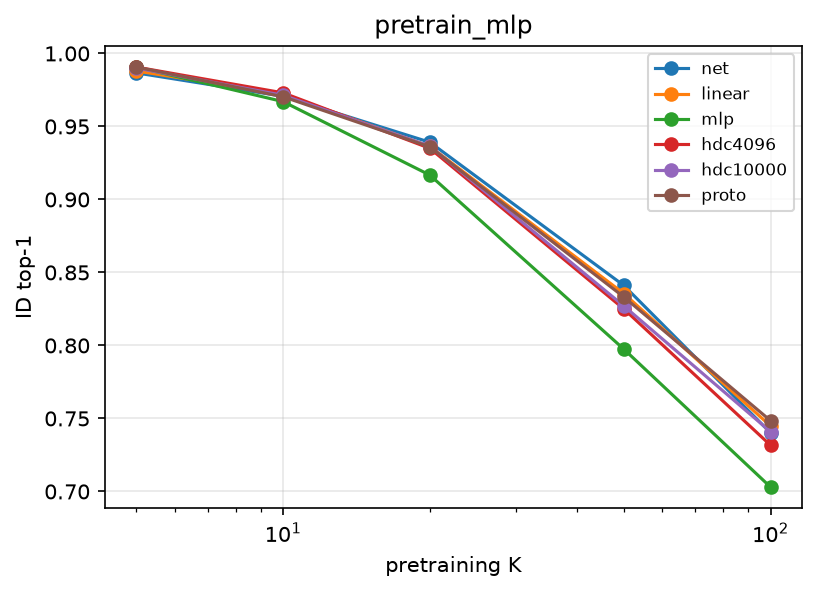

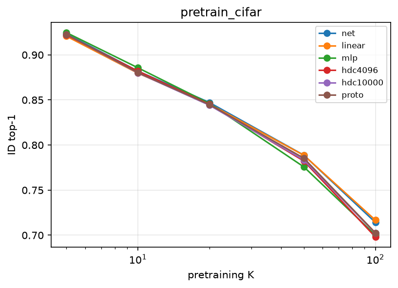

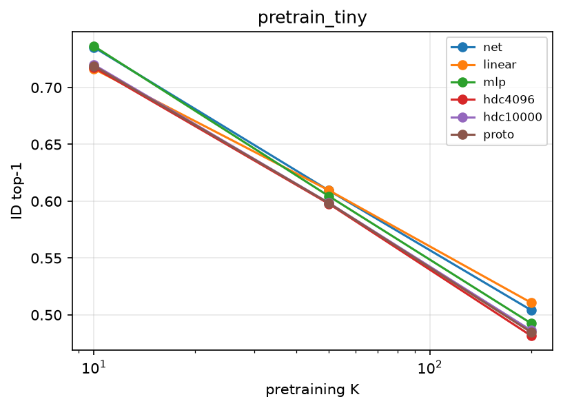

**Takeaways - image pretraining.**

* The network's own ID accuracy degrades with pretraining K, and the HDC head
  built on the frozen penultimate features degrades **by the same amount**:
  on CIFAR the `net`/`hdc4k` pair goes from `0.923/0.922` at K = 5 to
  `0.714/0.698` at K = 100, while the separately-trained linear probe reaches
  `0.717` at K = 100.  The `net`-vs-HDC gap never exceeds ~0.02 at any K;
  there is no HDC-specific degradation.
* **More pretraining classes make the representation better for novel
  classes**: no-label novel clustering in the penultimate space *rises* from
  `0.23` (K = 5) to `0.49` (K = 50) on CIFAR and from `0.24` (K = 10) to
  `0.38` (K = 50) on Tiny, and HDC tracks it.  The class count hurts base-class
  classification but helps novel-class geometry.
* TinyImageNet confirms the same ID story: `net 0.735 -> 0.504`,
  `HDC 0.718 -> 0.482`, `linear 0.716 -> 0.511` from K = 10 to 200.  OOD
  AUROC falls with K and favours the jointly-trained head
  (`net 0.731 -> 0.671` vs `HDC 0.657 -> 0.605`).
* OOD detection is roughly flat in K and only slightly favours the network's
  own softmax on the small image networks (CIFAR K = 50: `net 0.774` vs
  `HDC 0.737`; the gap is much larger for the synthetic MLP encoder above,
  `0.865` vs `0.654`).
* Noise robustness falls with K for every head, with the network's own head and
  HDC tracking each other.

---

## 6. Do HDC configurations close the gap?

Ten configurations at matched code length (4k / 10k): projections
`gauss` / `rade` / `sparse` / `ens2`; quantization `sign` (1 bit), `th2` / `th3`
(2- / 3-bit thermometer); prototypes `majority`, `median`, `projmean`; and
`lincodes`, a trained linear layer on the same codes (the capacity ceiling of
the encoding).  The `gauss` baseline is the head used everywhere else.

Gap to the trained linear head on the raw features (negative = HDC worse):

cifar100__dinov2_vitb14_reg: ID accuracy delta vs the trained linear head (4k / 10k)

| variant | 5 | 50 | 100 |
| :--- | ---: | ---: | ---: |
| ens2 | -0.007 / -0.004 | -0.039 / -0.036 | -0.054 / -0.050 |
| gauss | -0.003 / -0.007 | -0.036 / -0.036 | -0.052 / -0.051 |
| lincodes | +0.000 / +0.006 | +0.006 / +0.017 | +0.005 / +0.016 |
| majority | -0.008 / -0.010 | -0.047 / -0.043 | -0.062 / -0.058 |
| median | -0.007 / -0.010 | -0.047 / -0.043 | -0.062 / -0.058 |
| projmean | -0.006 / -0.009 | -0.043 / -0.036 | -0.058 / -0.053 |
| rade | -0.006 / -0.005 | -0.039 / -0.036 | -0.052 / -0.051 |
| sparse | -0.007 / -0.006 | -0.037 / -0.036 | -0.051 / -0.051 |
| th2 | -0.009 / -0.006 | -0.042 / -0.040 | -0.058 / -0.053 |
| th3 | -0.011 / -0.009 | -0.042 / -0.041 | -0.057 / -0.054 |

tinyimagenet__dinov2_vitb14_reg: ID accuracy delta vs the trained linear head (4k / 10k)

| variant | 10 | 100 | 200 |
| :--- | ---: | ---: | ---: |
| ens2 | -0.006 / -0.004 | -0.021 / -0.019 | -0.030 / -0.029 |
| gauss | -0.005 / -0.005 | -0.022 / -0.019 | -0.030 / -0.029 |
| lincodes | -0.000 / +0.003 | +0.003 / +0.008 | +0.002 / +0.007 |
| majority | -0.009 / -0.007 | -0.027 / -0.023 | -0.036 / -0.033 |
| median | -0.009 / -0.007 | -0.027 / -0.023 | -0.036 / -0.033 |
| projmean | -0.007 / -0.005 | -0.023 / -0.020 | -0.032 / -0.029 |
| rade | -0.005 / -0.005 | -0.021 / -0.020 | -0.029 / -0.028 |
| sparse | -0.003 / -0.004 | -0.021 / -0.020 | -0.030 / -0.029 |
| th2 | -0.015 / -0.015 | -0.041 / -0.038 | -0.045 / -0.043 |
| th3 | -0.020 / -0.017 | -0.040 / -0.039 | -0.046 / -0.044 |

cifar100__resnet18: ID accuracy delta vs the trained linear head (4k / 10k)

| variant | 50 | 100 |
| :--- | ---: | ---: |
| ens2 | -0.029 / -0.026 | -0.055 / -0.053 |
| gauss | -0.030 / -0.028 | -0.056 / -0.053 |
| lincodes | +0.026 / +0.047 | +0.032 / +0.053 |
| majority | -0.051 / -0.042 | -0.076 / -0.065 |
| median | -0.052 / -0.043 | -0.077 / -0.066 |
| projmean | -0.048 / -0.040 | -0.074 / -0.064 |
| rade | -0.032 / -0.028 | -0.056 / -0.054 |
| sparse | -0.029 / -0.025 | -0.056 / -0.052 |
| th2 | -0.030 / -0.026 | -0.056 / -0.054 |
| th3 | -0.032 / -0.026 | -0.058 / -0.052 |

gmm__raw: ID accuracy delta vs the trained linear head (4k / 10k)

| variant | 5 | 50 | 200 |
| :--- | ---: | ---: | ---: |
| ens2 | +0.087 / +0.092 | -0.004 / +0.009 | -0.029 / -0.008 |
| gauss | +0.091 / +0.088 | -0.004 / +0.009 | -0.030 / -0.007 |
| lincodes | +0.087 / +0.085 | -0.004 / +0.009 | -0.024 / -0.005 |
| majority | +0.085 / +0.087 | -0.020 / +0.001 | -0.058 / -0.017 |
| median | +0.085 / +0.088 | -0.020 / +0.002 | -0.059 / -0.017 |
| projmean | +0.088 / +0.084 | -0.019 / +0.003 | -0.056 / -0.018 |
| rade | +0.083 / +0.089 | -0.007 / +0.010 | -0.035 / -0.007 |
| sparse | +0.088 / +0.091 | -0.005 / +0.009 | -0.033 / -0.005 |
| th2 | +0.083 / +0.087 | -0.018 / +0.003 | -0.055 / -0.018 |
| th3 | +0.079 / +0.088 | -0.039 / -0.006 | -0.084 / -0.028 |

Auxiliary metrics at the largest K with novel classes:

cifar100__dinov2_vitb14_reg: auxiliary metrics at K=50 (mean over seeds)

| variant | AUROC 4k | AUROC 10k | cluster 4k | cluster 10k | noise0.10 4k | noise0.10 10k |
| :--- | ---: | ---: | ---: | ---: | ---: | ---: |
| linear (ref) | 0.830 | - | 0.703 | - | 0.590 | - |
| ens2 | 0.827 | 0.829 | 0.704 | 0.693 | 0.517 | 0.526 |
| gauss | 0.827 | 0.830 | 0.669 | 0.701 | 0.523 | 0.523 |
| lincodes | 0.829 | 0.831 | 0.669 | 0.701 | 0.589 | 0.602 |
| majority | 0.824 | 0.827 | 0.669 | 0.701 | 0.507 | 0.514 |
| median | 0.824 | 0.827 | 0.669 | 0.701 | 0.507 | 0.514 |
| projmean | 0.825 | 0.828 | 0.669 | 0.701 | 0.515 | 0.522 |
| rade | 0.826 | 0.828 | 0.698 | 0.692 | 0.519 | 0.526 |
| sparse | 0.828 | 0.829 | 0.694 | 0.699 | 0.524 | 0.522 |
| th2 | 0.828 | 0.829 | 0.635 | 0.688 | 0.500 | 0.508 |
| th3 | 0.826 | 0.828 | 0.658 | 0.666 | 0.500 | 0.508 |

tinyimagenet__dinov2_vitb14_reg: auxiliary metrics at K=100 (mean over seeds)

| variant | AUROC 4k | AUROC 10k | cluster 4k | cluster 10k | noise0.10 4k | noise0.10 10k |
| :--- | ---: | ---: | ---: | ---: | ---: | ---: |
| linear (ref) | 0.915 | - | 0.852 | - | 0.810 | - |
| ens2 | 0.917 | 0.919 | 0.836 | 0.892 | 0.778 | 0.780 |
| gauss | 0.918 | 0.920 | 0.856 | 0.852 | 0.778 | 0.781 |
| lincodes | 0.913 | 0.914 | 0.856 | 0.852 | 0.811 | 0.816 |
| majority | 0.916 | 0.918 | 0.856 | 0.852 | 0.770 | 0.775 |
| median | 0.916 | 0.917 | 0.856 | 0.852 | 0.770 | 0.775 |
| projmean | 0.917 | 0.919 | 0.856 | 0.852 | 0.777 | 0.781 |
| rade | 0.919 | 0.919 | 0.861 | 0.861 | 0.778 | 0.779 |
| sparse | 0.920 | 0.919 | 0.874 | 0.827 | 0.778 | 0.779 |
| th2 | 0.913 | 0.920 | 0.784 | 0.759 | 0.741 | 0.744 |
| th3 | 0.913 | 0.918 | 0.801 | 0.786 | 0.740 | 0.741 |

Projection-draw variance:

Baseline Gaussian HDC: accuracy range over 3 independent projection draws

| case | code len | mean range (max-min) | mean min | mean max |
| :--- | ---: | ---: | ---: | ---: |
| cifar100__dinov2_vitb14_reg | 4096 | 0.0025 | 0.823 | 0.825 |
| cifar100__dinov2_vitb14_reg | 10000 | 0.0028 | 0.824 | 0.826 |
| cifar100__resnet18 | 4096 | 0.0029 | 0.450 | 0.453 |
| cifar100__resnet18 | 10000 | 0.0020 | 0.453 | 0.455 |
| gmm__raw | 4096 | 0.0045 | 0.889 | 0.894 |
| gmm__raw | 10000 | 0.0042 | 0.903 | 0.907 |
| tinyimagenet__dinov2_vitb14_reg | 4096 | 0.0018 | 0.888 | 0.889 |
| tinyimagenet__dinov2_vitb14_reg | 10000 | 0.0022 | 0.888 | 0.891 |

**Takeaways - configuration ablation.**

* **Projection matrices do not matter.** Gaussian, Rademacher, sparse
  (Achlioptas 1/3) and a two-projection ensemble land within `0.003` of each
  other at every K and dataset; three independent projection draws move the
  baseline by less than `0.005` accuracy.  There is no projection-side headroom
  here.
* **More bits per coordinate are worse, not better.** At matched total code
  length the 2- and 3-bit thermometers cost `1-4` ID points,
  `0.005-0.02` AUROC and `0.05-0.15` no-label clustering accuracy vs the 1-bit
  sign code, and they lose robustness too.  Sign is the best quantizer tested.
* **Fancier prototype rules do not help.** Binary-majority and
  coordinate-median prototypes are `0.5-2` points below the real-valued
  class-mean prototype; encoding the class-mean feature once (`projmean`) sits
  in between.  The baseline mean/cosine rule is at the top of the prototype
  family.
* **The one thing that closes the gap is a trained readout.** `lincodes` - a
  linear softmax layer on the same 1-bit codes - matches or beats the trained
  linear head on the raw features at every K (CIFAR DINOv2 K=100:
  `+0.005/+0.016`; Tiny K=200: `+0.002/+0.007`), and on the weaker ResNet-18
  features it wins by `+0.03/+0.05` (CIFAR K=100).  It is also markedly more
  robust (CIFAR K=100, noise 0.10: `0.59/0.60` vs the prototype's `0.46`).
  The information is in the code; the hand-designed prototype rule is what
  loses it.
* **What the HDC representation is not good at:** multi-bit quantization does
  not fix clustering, and on the synthetic spherical data the sign prototype
  beats the trained linear head at K=5 (`+0.09`) but loses at K=200 (`-0.03`),
  with `lincodes` tracking the prototype rather than the linear head there.

## 7. Does the extractor change the gap?

The same head comparison across seven feature sources, from DINOv2 ViT-B/14
(strong self-supervised) down to ImageNet-supervised ResNet-50 / MobileNetV2 /
ResNet-18, DINOv1 ViT-S/16 and TinyViT-11M.  All use the same 70/30 split and
the same heads.

CIFAR-100 at K=100: extractor quality vs HDC gap

| backbone | linear acc | MLP acc | HDC4k acc | gap linear | gap MLP |
| :--- | ---: | ---: | ---: | ---: | ---: |
| dinov2_vitb14_reg | 0.777 | 0.778 | 0.724 | +0.053 | +0.054 |
| tinyvit_11m | 0.688 | 0.722 | 0.639 | +0.048 | +0.082 |
| dinov2_vits14_reg | 0.673 | 0.714 | 0.611 | +0.062 | +0.103 |
| dino_vits16 | 0.532 | 0.644 | 0.477 | +0.055 | +0.167 |
| resnet50 | 0.520 | 0.585 | 0.432 | +0.088 | +0.154 |
| mobilenet_v2 | 0.490 | 0.551 | 0.418 | +0.073 | +0.134 |
| resnet18 | 0.453 | 0.537 | 0.398 | +0.055 | +0.138 |

TinyImageNet at K=200: extractor quality vs HDC gap

| backbone | linear acc | MLP acc | HDC4k acc | gap linear | gap MLP |
| :--- | ---: | ---: | ---: | ---: | ---: |
| dinov2_vitb14_reg | 0.864 | 0.850 | 0.834 | +0.030 | +0.016 |
| tinyvit_11m | 0.814 | 0.798 | 0.778 | +0.036 | +0.020 |
| dinov2_vits14_reg | 0.801 | 0.796 | 0.762 | +0.039 | +0.034 |
| dino_vits16 | 0.732 | 0.740 | 0.668 | +0.064 | +0.071 |
| resnet50 | 0.681 | 0.694 | 0.608 | +0.073 | +0.086 |
| mobilenet_v2 | 0.613 | 0.622 | 0.540 | +0.073 | +0.082 |
| resnet18 | 0.588 | 0.623 | 0.536 | +0.052 | +0.087 |

Gap vs K for every extractor:

CIFAR-100: HDC(4k) accuracy gap to the linear / MLP head (negative = HDC worse)

| backbone | gap lin K=5 | gap lin K=10 | gap lin K=20 | gap lin K=50 | gap lin K=100 | gap mlp K=5 | gap mlp K=10 | gap mlp K=20 | gap mlp K=50 | gap mlp K=100 |
| :--- | ---: | ---: | ---: | ---: | ---: | ---: | ---: | ---: | ---: | ---: |
| dino_vits16 | +0.002 | - | - | +0.025 | +0.055 | +0.074 | - | - | +0.146 | +0.167 |
| dinov2_vitb14_reg | +0.006 | +0.016 | +0.026 | +0.039 | +0.053 | +0.020 | +0.039 | +0.044 | +0.056 | +0.054 |
| dinov2_vits14_reg | +0.004 | - | - | +0.042 | +0.062 | +0.027 | - | - | +0.095 | +0.103 |
| mobilenet_v2 | +0.009 | - | - | +0.042 | +0.073 | +0.049 | - | - | +0.116 | +0.134 |
| resnet18 | +0.011 | +0.022 | +0.028 | +0.030 | +0.055 | +0.074 | +0.097 | +0.108 | +0.119 | +0.138 |
| resnet50 | -0.003 | - | - | +0.059 | +0.088 | +0.056 | - | - | +0.134 | +0.154 |
| tinyvit_11m | -0.002 | - | - | +0.026 | +0.048 | +0.016 | - | - | +0.074 | +0.082 |

TinyImageNet: HDC(4k) accuracy gap to the linear / MLP head (negative = HDC worse)

| backbone | gap lin K=10 | gap lin K=20 | gap lin K=50 | gap lin K=100 | gap lin K=200 | gap mlp K=10 | gap mlp K=20 | gap mlp K=50 | gap mlp K=100 | gap mlp K=200 |
| :--- | ---: | ---: | ---: | ---: | ---: | ---: | ---: | ---: | ---: | ---: |
| dino_vits16 | +0.006 | - | +0.027 | - | +0.064 | +0.022 | - | +0.062 | - | +0.071 |
| dinov2_vitb14_reg | +0.004 | +0.004 | +0.012 | +0.021 | +0.030 | +0.011 | +0.013 | +0.017 | +0.017 | +0.016 |
| dinov2_vits14_reg | +0.001 | - | +0.013 | - | +0.039 | +0.019 | - | +0.029 | - | +0.034 |
| mobilenet_v2 | -0.001 | - | +0.034 | - | +0.073 | +0.022 | - | +0.064 | - | +0.082 |
| resnet18 | -0.002 | +0.000 | +0.016 | +0.033 | +0.052 | +0.041 | +0.050 | +0.068 | +0.078 | +0.087 |
| resnet50 | +0.001 | - | +0.034 | - | +0.073 | +0.023 | - | +0.068 | - | +0.086 |
| tinyvit_11m | -0.008 | - | +0.012 | - | +0.036 | +0.008 | - | +0.019 | - | +0.020 |

**Takeaways - extractor sweep.**

* **The gap grows as the extractor gets weaker and K gets larger.** On
  CIFAR-100 at K=100 the HDC-vs-linear gap goes from `+0.053` (DINOv2-B) and
  `+0.048` (TinyViT) to `+0.088` (ResNet-50) / `+0.073` (MobileNetV2); the gap
  to the best trained head (MLP) grows much more, from `+0.054` (DINOv2-B) to
  `+0.167` (DINOv1 ViT-S/16) and `+0.154` (ResNet-50).  TinyImageNet shows the
  same ordering (`+0.030` linear / `+0.016` MLP on DINOv2-B; `+0.073` /
  `+0.086` on ResNet-50).
* At small K the gap is negligible for every extractor (`<0.01` at K=5-10);
  the divergence is a large-K phenomenon.
* Supervised backbones (ResNet-50, MobileNetV2) have the largest gap per unit
  of accuracy: their penultimate features carry class information that a
  linear/prototype readout extracts much less well than an MLP does
  (ResNet-50 CIFAR K=100: linear `0.520`, MLP `0.585`, HDC `0.432`).
* Combined with Section 6: no random-projection or quantization choice closes
  this gap, but a trained readout on the same HDC codes does.  That is the
  concrete, evidence-backed target for an HDC-for-high-class-count project.

---

## 8. Cross-benchmark summary

Cross-benchmark summary (means over seeds)

| benchmark | backbone | ID hdc Kmin→Kmax | ID linear Kmin→Kmax | ID mlp Kmax | ID proto Kmax | Δ(10k-4k) | cluster feat/hdc @Kmin,N=20 | AUROC hdc Kmin→Kmax | 5-shot hdc |
| :--- | :--- | ---: | ---: | ---: | ---: | ---: | ---: | ---: | ---: |
| CIFAR-100 | dino_vits16 | 0.877 → 0.477 | 0.879 → 0.532 | 0.644 | 0.478 | 0.006 | 0.515/0.478 | 0.791 → 0.616 | 0.568 |
| CIFAR-100 | dinov2_vitb14_reg | 0.957 → 0.724 | 0.962 → 0.777 | 0.778 | 0.726 | 0.003 | 0.691/0.679 | 0.950 → 0.827 | 0.801 |
| CIFAR-100 | dinov2_vits14_reg | 0.934 → 0.611 | 0.938 → 0.673 | 0.714 | 0.613 | 0.004 | 0.597/0.569 | 0.916 → 0.706 | 0.711 |
| CIFAR-100 | mobilenet_v2 | 0.878 → 0.418 | 0.887 → 0.490 | 0.551 | 0.419 | 0.001 | 0.463/0.445 | 0.801 → 0.603 | 0.523 |
| CIFAR-100 | resnet18 | 0.837 → 0.398 | 0.848 → 0.453 | 0.537 | 0.396 | 0.004 | 0.459/0.448 | 0.749 → 0.601 | 0.524 |
| CIFAR-100 | resnet50 | 0.877 → 0.432 | 0.874 → 0.520 | 0.585 | 0.431 | 0.002 | 0.451/0.444 | 0.814 → 0.618 | 0.557 |
| CIFAR-100 | tinyvit_11m | 0.948 → 0.639 | 0.946 → 0.688 | 0.722 | 0.640 | 0.004 | 0.704/0.729 | 0.950 → 0.757 | 0.770 |
| TinyImageNet | dino_vits16 | 0.913 → 0.668 | 0.919 → 0.732 | 0.740 | 0.669 | 0.001 | 0.719/0.693 | 0.888 → 0.825 | 0.778 |
| TinyImageNet | dinov2_vitb14_reg | 0.960 → 0.834 | 0.964 → 0.864 | 0.850 | 0.836 | 0.001 | 0.833/0.852 | 0.983 → 0.919 | 0.915 |
| TinyImageNet | dinov2_vits14_reg | 0.942 → 0.762 | 0.943 → 0.801 | 0.796 | 0.764 | 0.002 | 0.827/0.831 | 0.968 → 0.913 | 0.873 |
| TinyImageNet | mobilenet_v2 | 0.873 → 0.540 | 0.873 → 0.613 | 0.622 | 0.542 | 0.000 | 0.660/0.617 | 0.779 → 0.712 | 0.693 |
| TinyImageNet | resnet18 | 0.847 → 0.536 | 0.845 → 0.588 | 0.623 | 0.541 | 0.004 | 0.644/0.629 | 0.817 → 0.660 | 0.668 |
| TinyImageNet | resnet50 | 0.892 → 0.608 | 0.892 → 0.681 | 0.694 | 0.611 | 0.003 | 0.672/0.655 | 0.853 → 0.781 | 0.760 |
| TinyImageNet | tinyvit_11m | 0.954 → 0.778 | 0.946 → 0.814 | 0.798 | 0.780 | 0.000 | 0.840/0.828 | 0.954 → 0.901 | 0.892 |
| synth bits | D=4096 | 0.999 → 0.989 | 0.999 → 0.991 | 0.422 | 0.989 | - | 0.196/0.196 | 1.000 → 0.991 | 0.572 |
| synth bits | D=10000 | 1.000 → 1.000 | 1.000 → 1.000 | 0.797 | 1.000 | - | 0.299/0.299 | 1.000 → 1.000 | 0.871 |
| synth gmm | proj | 0.984 → 0.796 | 0.886 → 0.828 | 0.705 | 0.838 | 0.013 | 0.880/0.403 | 0.981 → 0.866 | 0.473 |
| synth subspace | proj | 0.987 → 0.835 | 0.912 → 0.866 | 0.752 | 0.875 | 0.013 | 0.879/0.557 | 0.986 → 0.889 | 0.523 |
| pretrain MLP | MLP | 0.991 → 0.732 | 0.988 → 0.745 | 0.703 | 0.748 | 0.002 | 0.111/0.110 | 0.901 → 0.604 | 0.079 |
| pretrain CIFAR | SmallResNet | 0.922 → 0.698 | 0.921 → 0.717 | 0.700 | 0.703 | 0.001 | 0.225/0.220 | 0.772 → 0.737 | 0.232 |
| pretrain Tiny | SmallResNet | 0.718 → 0.482 | 0.716 → 0.511 | 0.493 | 0.485 | 0.003 | 0.243/0.253 | 0.657 → 0.605 | 0.276 |

---

## 9. Direct answers

### Q1 - does HDC prototype accuracy degrade with more classes?

**Yes for the class count, no for the HD dimension, and the loss is not
HDC-specific.**

* **ID / base accuracy:** HDC ID accuracy falls monotonically with K on every
  real-feature benchmark (CIFAR-100 DINOv2 `0.957 -> 0.724`; TinyImageNet
  `0.960 -> 0.834`; ResNet-18 `0.837 -> 0.398` on CIFAR and `0.847 -> 0.536`
  on Tiny; from-scratch networks `0.922 -> 0.698` on CIFAR and `0.718 -> 0.482`
  on Tiny).  The HDC-native `bits` benchmark is the exception:
  prototype capacity is not exhausted up to K = 200 there (`0.999 -> 0.989`
  at D = 4096), because random hypervectors are maximally separated.
* **Independence from network degradation:** in the frozen-feature suites the
  extractor does not change with K, so the fall is the head+geometry; in the
  from-scratch suites both the network's own head and HDC fall together
  (`net ~ hdc4k` at every K), so the HDC head does not add its own
  class-count degradation.
* **Head-specific residual:** beyond the shared degradation, the HDC prototype
  rule carries a residual readout gap that grows with K (Section 6): about
  0.05 on DINOv2 at K=100, up to 0.09 on ResNet-50, and 0.14-0.17 against an
  MLP on the weaker supervised backbones.  This part is specific to the
  prototype readout, not the projection: a trained linear layer on the same
  codes removes it (`lincodes` in Section 6).
* **Robustness:** ID accuracy under pixel noise/noised features decays with K
  for all heads, HDC and network layers closely in step; the trained layers
  keep a small absolute edge on images at every K, and no head shows a
  relative robustness advantage that grows with K.
* **Novel classes with no labels or pretraining:** accuracy falls strongly
  with the number of novel classes N (CIFAR `0.86 -> 0.61`; Tiny `0.98 ->
  0.74`) and is roughly flat in K for clustering, while OOD detection falls
  with K (`0.95 -> 0.83` CIFAR) and is flat in N.  In other words, base-class
  count controls novelty separation, novel-class count controls cluster
  separation.
* **Dimension:** at D = 4096 vs D = 10000 the HDC deltas are `+0.001..+0.005`
  on real features, `+0.013` mean on projected synthetic features, and large
  only for noisy HDC-native codes at high flip rates.  **The gains/losses with
  K are not a dimension-size effect at these D.**

### Q2 - does HDC outperform a standard network classification layer?

**It depends on the regime, and on strong features the trained layer usually
wins:**

| regime | winner | evidence |
| :--- | :--- | :--- |
| ID accuracy, DINOv2/ResNet features | **linear/MLP**, by 2-5 pts at large K, more on weak backbones | CIFAR K=100: `0.724` HDC vs `0.777` linear; Tiny K=200: `0.834` vs `0.864`; ResNet-50 CIFAR K=100: `0.432` vs `0.520`/`0.585` |
| HDC configuration space (projections / quantization / prototypes) | **no hand-designed config closes the gap**; only a trained readout on the codes does | Section 6: every projection/quantization/prototype variant stays `0.03-0.09` below linear at large K; `lincodes` matches/beats it |
| extractor quality | gap grows from ~3-5 pts (DINOv2-B) to 7-9 pts (ResNet-50 / MobileNetV2), and 14-17 pts to MLP | Section 7 |
| ID accuracy, random HDC-native codes | **tie** (HDC/linear/proto), MLP collapses | bits D=4096 K=200: `0.989/0.991/0.989` vs MLP `0.422` |
| robustness | tie / trained head slightly better on images, **HDC clearly better at D=10000 vs 4096 on codes**; a trained readout on codes is clearly more robust | bits flip0.46; CIFAR noise; `lincodes` CIFAR K=100 noise 0.10 `0.59` vs `0.46` |
| novel no-label clustering | **tie on real features** (HDC ~ feature k-means); **feature k-means wins on synthetic projections**; multi-bit quantization hurts | CIFAR/Tiny vs gmm `0.40` HDC vs `0.88` features; Section 6 |
| OOD detection | **tie with linear on DINOv2**, better than MLP on DINOv2, but **network softmax wins on from-scratch networks at large K** | pretrain MLP K=50: `0.865` net vs `0.654` HDC; pretrain CIFAR K=50: `0.774` vs `0.737`; pretrain Tiny K=50: `0.671` vs `0.605` |
| 5-shot novel | **HDC ahead on codes** (`0.57` vs `0.46`), tie on images | bits / CIFAR / Tiny 5-shot tables |
| data-efficiency (few labels) | **HDC / prototypes** | same tables |

The consistent picture: the HDC prototype rule is a strong, training-free
baseline that matches feature-space prototypes and is remarkably insensitive
to the HD dimension; a trained layer buys a few points on strong features and
a larger margin on weak ones; prototype *distance* is a weaker novelty score
than a trained softmax once K is large.  Sections 6-7 locate the deficit
precisely: it is not the random projection (any projection works equally well)
and not the number of bits (more bits hurt); it is the hand-designed
class-mean readout.  A trained linear layer on the same codes matches or beats
the raw-feature linear head, so the headroom is real and the fix is on the
readout side.

**Is a future project on HDC for high-class-count settings valid?** Yes, with
a specific target.  The gap is negligible at K <= 10, reaches 3-5 points on
strong self-supervised features at K = 100-200, 7-9 points on cheap supervised
backbones, and up to 14-17 points against an MLP.  It is largest exactly where
HDC is most attractive - weak/cheap extractors and large K - and it survives
every projection/quantization change while disappearing under a trained
readout.  A project on adaptive/learned HDC prototypes or lightweight readouts
over HDC codes in high-class regimes is therefore well-motivated; a project on
better random projections or quantizers is not, on this evidence.

---

## 10. Limitations and notes

* The HDC head here is the supervised prototype classifier (class means from
  labelled data), not the full online discovery method from the NCD_HDC repo;
  the "no labels" novel test uses spherical k-means with the **oracle** class
  count N.  Discovery without K is a separate question.
* Synthetic `bits` uses independent bit flips; its accuracy at D = 10000 is
  saturated at K <= 200, so capacity limits may appear only for much larger K
  or smaller D.
* The from-scratch image networks are deliberately small ResNets trained for
  60/40 epochs; conclusions are about relative head behaviour, not about the
  best achievable accuracy of those backbones.
* Image features follow the old repo's protocol: 70/30 per-class split of the
  available images, Resize(256) + CenterCrop(224), L2-normalized pooled
  features.
* Seeds control class-subset selection, head initialization/training and the
  HDC projection; 3 seeds for the image suites (2 for pretrain Tiny) make the
  standard deviations in the tables non-trivial.
* OOD AUROC for `mlp` uses max-softmax, which is known to be miscalibrated;
  the lower MLP AUROCs are partly a calibration artefact, not necessarily a
  worse representation.
* `lincodes` in the configuration ablation is a **trained** readout; it is
  included as the capacity ceiling of the HDC encoding (what is recoverable
  from the codes), not as a training-free HDC method.  It shows where the
  information lives, not that the online, label-free HDC pipeline can reach
  that ceiling without training.
* The configuration ablation uses a reduced K grid (three K values, 3 seeds on
  the main backbones) and the new-extractor sweep uses 2 seeds; the effect
  sizes reported (0.03-0.17 accuracy) are far larger than the seed spread.
* Multi-bit quantization is only tested through Gaussian-quantile thermometer
  codes at matched total code length; other multi-bit schemes (e.g. scalar
  integer codes with L1 distance) were not run.

## 11. Reproducing

```bash
# 1. extract and cache frozen image features (DINOv2 + ResNet-18, clean + noise)
python scripts/extract_features.py --datasets cifar100 tinyimagenet \
    --backbones dinov2_vitb14_reg resnet18 --perturbations clean noise0.05 noise0.10

# 1b. extra extractors for the backbone sweep (clean features only)
python scripts/extract_features.py --datasets cifar100 tinyimagenet \
    --backbones dinov2_vits14_reg dino_vits16 resnet50 mobilenet_v2 tinyvit_11m \
    --perturbations clean

# 2. run the suites (records are written under results/raw; reruns skip done runs)
python scripts/run_synthetic.py
python scripts/run_images.py --datasets cifar100 tinyimagenet \
    --backbones dinov2_vitb14_reg resnet18 --seeds 0 1 2
python scripts/run_pretrain.py --suite mlp_synthetic cifar --seeds 0 1 2
python scripts/run_pretrain.py --suite tiny --seeds 0 1 --ks 10 50 200 --epochs 40

# 2b. configuration ablation and extractor sweep
python scripts/run_variants.py --cases all
python scripts/run_images.py --datasets cifar100 \
    --backbones dinov2_vits14_reg dino_vits16 resnet50 mobilenet_v2 tinyvit_11m \
    --seeds 0 1 --ks 5 50 100 --skip-robust
python scripts/run_images.py --datasets tinyimagenet \
    --backbones dinov2_vits14_reg dino_vits16 resnet50 mobilenet_v2 tinyvit_11m \
    --seeds 0 1 --ks 10 50 200 --skip-robust

# 3. tables, figures and this README
python scripts/make_report.py
python scripts/build_readme.py
```

Raw records: `results/raw/`; tidy CSVs, markdown tables and figures:
`results/tables/`, `results/figures/`.  Feature caches (~4 GB) are written to
`results/features/` and are not committed.

Reference environment: Python 3.14, `torch 2.13.0+cu130`, `timm 1.0.28`,
`scikit-learn 1.9`, one NVIDIA RTX 5080 (16 GB); feature extraction uses
autocast fp16, head training fp32.
